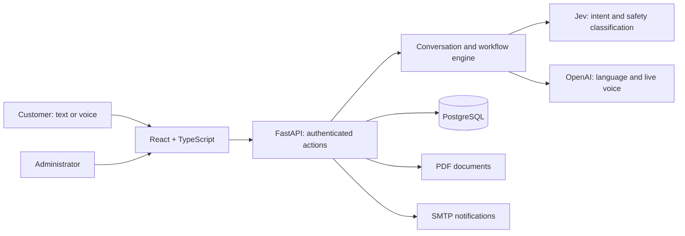

<p align="center"></p>

# Nexqori

**Understand a charge. Resolve a complaint. Follow the outcome.**

Nexqori connects conversational banking with a reviewable complaint workflow. Nexi helps a customer find a transaction, compare it with their usual spending, prepare a complaint and follow its resolution. Administrators receive the context and evidence needed to review the case.

[**Open the live demo →**](https://nexqori.bmachuca-dev.com) · [Administrator panel](https://nexqori.bmachuca-dev.com/admin/complaints) · [Local setup](#run-locally) · [Documentation](docs/README.md)

## Try the demo

1. Sign in with a test account supplied by the team. Email and document number are both supported.
2. Ask Nexi to review the phone charge. The example compares **459 MXN** with five previous payments averaging **299 MXN**.
3. Review the automatically prepared complaint, then confirm submission. **My complaints** shows the case and its reference.
4. In a separate browser profile, sign in as an administrator. Review the evidence, approve the complaint and confirm the refund.
5. Return as the customer: ask for the case status, then ask **“Can you filter the results to show only the refund?”** The app opens the credited transaction.

The interface supports **Español, English and Português**, including mobile layouts. Voice requires microphone permission. Text chat remains available.

### Where to find test credentials

Credentials belong to each installation; they are not embedded in source code.

| Installation | Private credentials location |
| --- | --- |
| Hosted AWS demo — team handoff | `.local/deploy/aws/nexqori-20261005/ACCESOS.private.md` on the maintainer’s machine |
| Local Bryan + administrator scenario | `.local/ux-users/bryan-demo/ACCESOS.private.md` |
| Fresh local installation | `.env`: `CUSTOMER_PASSWORD`, `ADMIN_PASSWORD`, `SECOND_CUSTOMER_PASSWORD` |

For the hosted demo, obtain the **customer and administrator test accesses from the team’s private handoff**. These files are excluded from Git and are not URLs on the demo server. Do not use the AWS credentials for a fresh local database. [Test profiles and preparation](docs/usuarios-prueba-ux.md).

## What the product supports

- **Investigate:** search transactions, compare recurring charges and review example service conditions.
- **Act:** prepare and confirm a complaint, preserve the conversation and open the registered case.
- **Review:** an administrator sees the summary, evidence, documents, activity and staged resolution.
- **Follow up:** report the actual refund status and open the matching credit with a transaction filter.
- **Keep records:** generate account/request PDFs in My documents; send submission and refund notifications when SMTP is configured.

This is a working prototype with synthetic banking records. Payments, refunds and card controls update its PostgreSQL records; they do not settle money or block cards at an external bank. Provider calls and SMTP can incur usage. A notification accepted by SMTP is not proof of inbox delivery.

## Architecture



The server checks ownership, confirmation and idempotency. A model proposal is not permission to execute a banking action. Refunds require an administrator’s decision; querying their status does not issue another credit. [Architecture](docs/arquitectura.md) · [Banking chat](docs/chat-bancario-y-pagos.md) · [Voice](docs/voz-gpt-live.md).

## Run locally

Requirements: **Node.js 24**, Git and **Docker Compose** with Linux containers.

```sh
git clone https://github.com/nexqori/nexqori.git
cd nexqori
npm ci
npm run setup
npm run docker:up
```

Open **http://localhost:5180**. Setup creates a private `.env`; the initial customers are `andrea@nexqori.com` / document `00000001` and `mateo@nexqori.com` / `00000003`. The administrator is `admin@nexqori.com` / `00000002`. Use the corresponding password variable in `.env`.

To prepare the same recurring-charge scenario locally:

```sh
node scripts/prepare-bryan-demo.mjs --confirm-local
node scripts/demo-access.mjs --confirm-local
```

The commands write private accesses at the path above. Repeated preparation preserves existing activity. Changing `.env` after first startup does not change passwords already stored in PostgreSQL. [Developer guide](INICIO-EQUIPO.md).

Voice is opt-in through `compose.voice.yaml` and private provider configuration. AWS uses `compose.cloud.yaml` for HTTPS. See [deployment](docs/despliegue-aws-compose.md) and [email setup](docs/notificaciones-gmail.md). Keep the existing database volume when restarting.

## Verification and contribution

```sh
npm test
npm run build
docker compose exec api python -m pytest backend/tests -q
npm run test:ui
npm run test:chat:flow
```

UI checks require the local app and Playwright/Edge. They create identified synthetic verification records. Live voice checks use configured providers and are separate from deterministic CI.

Work in `feature/*`, `fix/*` or `docs/*` branches and submit focused pull requests. `main` is the stable release line; `develop` is the integration line. CI runs application, intent-lab and security-lab checks. Version tags identify releases. [Branch and release policy](docs/trabajo-en-github.md).

`.env`, API/SMTP keys, SSH keys, database backups, original datasets, private PDFs and test access files stay outside Git. Secret scanning checks committed history; do not paste provider keys into issues or pull requests.
