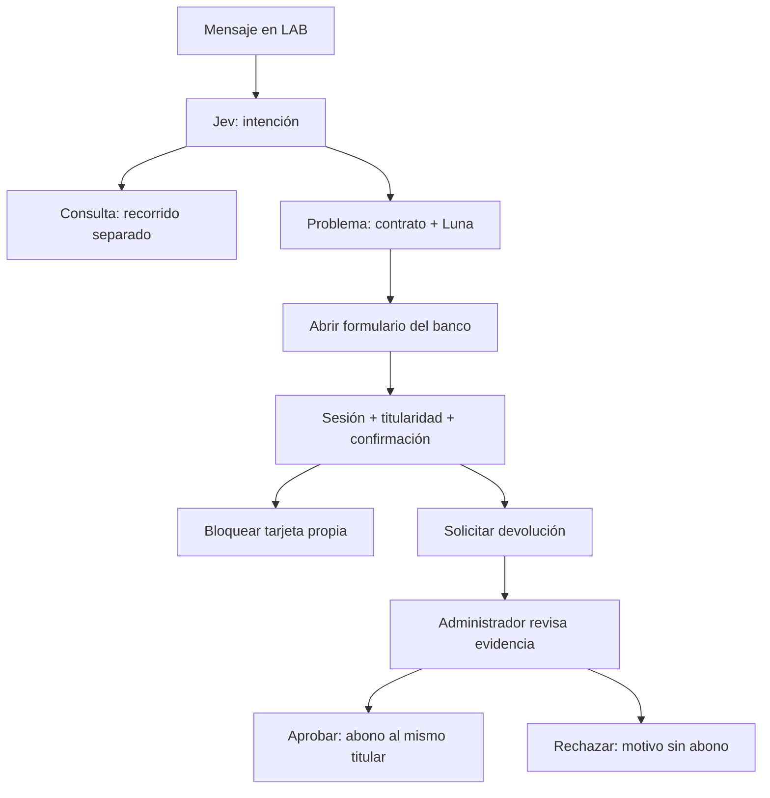

# Acciones de problemas y consultas separadas

Los seis contratos de problemas están en `backend/workflow_catalog.json`, versión 2. Las consultas de saldo, movimientos, tarjetas y productos se enrutan aparte. El LAB conserva las 23 etiquetas para comparar clasificación; sólo los seis problemas activan contrato + respuesta de Luna. Una consulta no carga instrucciones de problemas ni llama a Luna en ese recorrido.

## Qué se puede activar

| Caso | Función disponible | Quién confirma | Efecto comprobable |
| --- | --- | --- | --- |
| Cargo no reconocido | Abrir Tarjetas y bloquear una tarjeta propia | Titular, contraseña y confirmación | Estado `blocked`, fecha y auditoría; el servidor impide revelar datos. |
| Cargo no reconocido, importe incorrecto o problema de pago con cargo completado | Solicitar devolución desde el folio | Titular | Revisión `pending`; el saldo todavía no cambia. |
| Devolución pendiente | Aprobar o rechazar, con evidencia y motivo | Administrador, contraseña y confirmación | Aprobación: un abono, un movimiento positivo y auditoría en la misma transacción. Rechazo: motivo registrado, sin abono. |
| Problema de app, sucursal o calidad | Registrar y seguir el caso | Titular | Solicitud y auditoría; no habilita devolución por sí solo. |
| Consulta | Abrir su sección bancaria | Titular autenticado | Consulta propia, sin activar contratos de problemas. |



El LAB sólo ofrece enlaces permitidos. No tiene sesión del banco, credenciales delegadas ni herramientas para escribir en PostgreSQL. El chat bancario sigue separado de Jev/Luna. Una frase del modelo o `confirmed=true` en su respuesta no activa una operación. Los mensajes no son una fuente verificada de evidencia.

## Contratos ejecutables de la API

| Endpoint | Entrada permitida | Controles |
| --- | --- | --- |
| `POST /api/cards/{id}/block` | `password`, `confirmed`, `requestKey` | Cliente titular, CSRF, origen, límite de intentos, bloqueo de fila e idempotencia. |
| `GET /api/requests/{id}/refund` | Folio en ruta | Titular; estado de revisión o importe/destino elegibles derivados del servidor. |
| `POST /api/requests/{id}/refund` | `confirmed`, `requestKey` | Folio y cargo propios, débito completado, contrato habilitado, cuenta del mismo titular. |
| `GET /api/admin/requests/{id}/refund` | Folio en ruta | Sólo administrador; revisión con cuenta enmascarada. |
| `POST /api/admin/refunds/{id}/decision` | `decision` (`approve`/`reject`), `note`, `password`, `confirmed`, `requestKey` | Sólo administrador; revalidación del cargo y destino antes del abono; decisión final e idempotente. |

La identidad se deriva de la cookie de sesión. No se aceptan `userId`, importe ni destino en las mutaciones. Las FK compuestas vinculan solicitud, cargo, tarjeta, abono y cuenta con el mismo titular. Las claves de idempotencia no pueden reutilizarse para otra operación. Repetir la misma decisión devuelve el comprobante, sin otro abono; cambiarla después devuelve conflicto.

## Regla local de devolución

Es una política propia elegida para esta base: devolución completa, una por cargo y sin devolución parcial. Sólo cargos negativos completados; quedan excluidos créditos, abonos de devolución, pendientes y rechazados. La transacción original permanece intacta. La cuenta es la del cargo o la cuenta de liquidación vinculada explícitamente a la tarjeta; nunca se elige «la primera cuenta» ni se infieren enlaces desde el dataset.

La revisión requiere una solicitud expresa del cliente y un motivo de al menos diez caracteres del administrador. El software registra esa revisión; no determina por sí mismo si la evidencia demuestra fraude o duplicación. Las decisiones no se pueden revertir ni reabrir desde esta versión.

La migración `a318d902bc44` añade `refunds`, estado/bloqueo/cuenta asociada de tarjeta, referencias de producto en auditoría y restricciones de titularidad. Sólo la tarjeta fixture conocida `card-01` queda vinculada a `account-01`; tarjetas sin cuenta configurada no admiten devolución.

## Efectos y límites

Bloqueos y abonos son persistentes y efectivos **dentro de Nexqori local**. No se envía un bloqueo a un emisor ni se mueve dinero en una red bancaria. No hay autorización de compras, conciliación, ledger de doble partida, liquidación externa ni política bancaria certificada. El saldo inicial sigue siendo un fixture; los abonos posteriores sí actualizan ese saldo de forma atómica. No se implementa desbloqueo de tarjeta en este alcance. Los datos ya revelados pueden haber sido vistos por el usuario y conservan su límite visual de 60 segundos.

Los bloqueos de fila y la unicidad en PostgreSQL evitan dobles abonos y actualizaciones perdidas. Los límites de intentos siguen siendo locales al único proceso de API. Contraseñas, PAN/CVV y claves de proveedores no se escriben en auditoría ni se envían al LAB.

## Verificación y recorrido

Mis solicitudes y Administración muestran el estado de devolución y su ID persistente; ver [trazabilidad, búsqueda y consulta del movimiento](trazabilidad-solicitudes.md). La conversación del banco puede leer registros del movimiento propio, pero no aprobar, bloquear ni devolver por instrucciones del chat.

1. En **Tarjetas**, elegir **Bloquear tarjeta**, revisar la terminación, introducir contraseña y confirmar. Al recargar debe mantenerse bloqueada y la API debe rechazar revelar datos.
2. En **Mis solicitudes**, abrir un reclamo de un cargo completado y elegir **Solicitar devolución**. Revisar importe/cuenta y confirmar. Debe quedar en revisión sin modificar saldo.
3. Con el administrador, abrir ese folio. Revisar evidencia, elegir aprobar/rechazar, indicar motivo, contraseña y confirmar. El titular ve el desenlace; si se aprueba, ve un movimiento de abono y el saldo actualizado.
4. En **Auditoría**, filtrar `card_blocked`, `refund_requested`, `refund_approved` o `refund_rejected`: comprobar actor, titular, producto y folio.

Pruebas: `backend/tests/test_operations.py` cubre autorización, confirmación, cuentas ajenas, reintentos, cambios de evidencia, rechazo y estados no elegibles. Las pruebas de migración preservan datos y restricciones. Para concurrencia real y recorrido visual con registros ficticios nuevos, en PowerShell:

```powershell
Get-Content -Raw scripts/verify-problem-operations.py | docker compose exec -T -e NEXQORI_LOCAL_VERIFY=1 api python - > .local/verification/operations-private.json
node scripts/nexqori-operations.mjs
```

El JSON contiene una contraseña aleatoria del usuario de verificación: permanece privado e ignorado por Git. El script crea registros persistentes marcados Verificación y prueba dos aprobaciones simultáneas del mismo cargo y dos cargos distintos sobre la misma cuenta; comprueba que los saldos anteriores de otros titulares no cambian. Las pruebas UI ordinarias del banco deben ejecutarse en serie.
