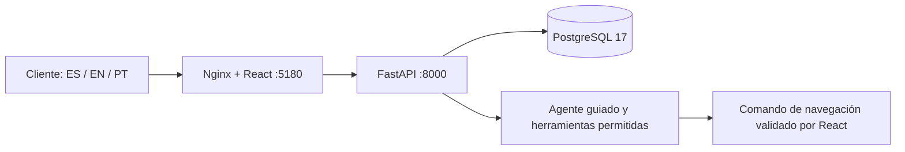

# Arquitectura de Nexqori

Stack elegido por Bryan: **React + FastAPI + PostgreSQL**. TypeScript, Vite y react-i18next en interfaz; SQLAlchemy y Alembic en API. Las versiones efectivas están fijadas en `package-lock.json` y `backend/requirements.lock`.

Sólo web publica un puerto, enlazado a 127.0.0.1. API y base son internas a Compose. Web y API se ejecutan sin root; la API usa el rol PostgreSQL `nexqori_app`, sin superusuario. El volumen `nexqori_postgres_data` conserva los datos al detener/recrear contenedores. La API aplica migraciones y un seed idempotente al arrancar. Cambiar claves en `.env` después del primer arranque no cambia automáticamente las claves persistidas.

## Modelo

| Tabla | Finalidad y límites |
| --- | --- |
| users | Correo y documento únicos, Argon2, rol cliente/admin, idioma es/en/pt y tamaño de texto. |
| sessions | Hash de token opaco, token CSRF, caducidad fija de 8 horas. |
| products | Titular, tipo, últimos cuatro dígitos, saldo en unidades menores, moneda MXN. |
| card_profiles | Tarjeta/titular y cuenta de abono por FK compuesta, vigencia, estado active/blocked e idempotencia del bloqueo. Sin PAN ni CVV almacenado. |
| transactions | Titular y producto coherentes por FK compuesta; importe entero y estado. |
| requests | Titular, servicio de catálogo, movimiento opcional, cuenta de origen con FK compuesta, datos específicos JSON, detalle, idempotencia y estado. |
| refunds | Solicitud de devolución, cargo original único, importe y cuenta del titular, decisión administrativa y movimiento de abono. |
| audit_events | Actor, fecha y acción: login, logout, solicitud, revisión, derivación, navegación propuesta. |
| conversations | Titular, título, idioma original y fechas. |
| messages | FK compuesta de conversación y titular; contenido e idioma original. |

No es un libro mayor: no hay contabilidad de doble partida, liquidación ni conciliación externa. Las devoluciones aprobadas sí generan un movimiento de abono y actualizan el saldo local atómicamente. El saldo inicial del seed es ilustrativo y no se calcula sumando el historial de ejemplo. Moneda y fecha de presentación pertenecen al escenario de México; elegir portugués o inglés no convierte MXN.

## API

Contrato completo en `/api/openapi.json`.

| Ruta | Permiso y efecto |
| --- | --- |
| GET /api/health | Salud de API y consulta real a PostgreSQL. |
| POST /api/auth/login | Origen permitido, JSON y límites de intentos; crea sesión y auditoría. |
| GET /api/session | Sesión vigente; perfil y CSRF. |
| POST /api/auth/logout | Revoca sesión y borra cookie. |
| PATCH /api/profile/locale | Idioma propio validado. |
| GET /api/bootstrap | Productos, movimientos, solicitudes y auditoría propios; no precarga mensajes. |
| PATCH /api/profile/preferences | Tamaño de texto propio: small/medium/large. |
| GET /api/conversations | Cliente: conversaciones propias, páginas de 20. |
| GET /api/conversations/{id} | Cliente titular: mensajes, páginas de 50 con cursor anterior. |
| GET /api/services y /api/services/{id} | Cliente: catálogo, búsqueda, categoría y ES/EN/PT. |
| POST /api/services/{id}/requests | Cliente, CSRF, confirmación y titularidad: registra solicitud específica. No debita ni liquida. |
| POST /api/requests | Cliente, confirmación, idempotencia y movimiento propio si existe. |
| POST /api/requests/{id}/handoff | Cliente titular y confirmación; derivación simulada idempotente. |
| POST /api/assistant | Cliente, mensaje ES/EN/PT, página permitida; respuesta guiada y navegación opcional. |
| POST /api/assistant/tools/read | Cliente y CSRF; herramienta de lectura de lista cerrada, referencias propias y auditoría. Rechaza operaciones financieras. |
| GET /api/admin/overview | Administrador: usuarios sin hashes, solicitudes y auditoría. |
| GET /api/requests/{id}/trace | Cliente titular: detalle, registros actuales, conversación vinculada y actividad paginada; lectura auditada. |
| GET /api/admin/users/{userId}/requests/{id}/trace | Administrador: mismo detalle comprobando la relación folio/titular; lectura auditada. |
| POST /api/admin/requests/{id}/review | Administrador y confirmación; recibida → en revisión. |
| POST /api/cards/{id}/block | Titular, contraseña, confirmación e idempotencia; bloqueo persistente local y auditoría. |
| GET /api/requests/{id}/refund | Titular: elegibilidad, importe, cuenta enmascarada y revisión de devolución. |
| POST /api/requests/{id}/refund | Titular y confirmación: solicita revisión; no abona. |
| GET /api/admin/requests/{id}/refund | Administrador: datos de revisión. |
| POST /api/admin/refunds/{id}/decision | Administrador, contraseña, evidencia y confirmación: aprueba un abono local único o rechaza sin cambiar saldo. |

Las mutaciones autenticadas comprueban CSRF y origen, además del esquema Pydantic (campos extra rechazados). Cookie HttpOnly, SameSite=Lax, token aleatorio almacenado por hash; Secure=false sólo para el HTTP local. No se guardan tokens en localStorage. En HTTPS debe activarse Secure y configurarse el origen concreto.

Se rechazan cuerpos mayores a 16 KB. Los intentos de login se limitan por cuenta resuelta y por IP: alternar correo/documento no evita el límite. Los limitadores viven en memoria de un único worker; detrás del proxy local la IP es compartida. No son distribuidos. Nginx añade CSP y deshabilita el micrófono; OpenAPI se entrega como JSON sin depender de un Swagger externo.

## Alcance verificado y siguiente integración

Las pruebas API usan SQLite temporal para aislar casos y validar reglas; la ejecución integral y la persistencia se comprueban sobre PostgreSQL de Docker. Las pruebas de interfaz verifican idiomas, acceso, navegación, solicitudes, derivación, responsive y accesibilidad automatizada. Esto no equivale a una auditoría de seguridad bancaria ni a accesibilidad certificada.

Para producción se necesitan decisiones y servicios específicos: identidad/MFA y recuperación, TLS, gestión de secretos, límites distribuidos, copias/restauración, trazas y alertas, auditoría protegida, integraciones y políticas operativas. El modelo de IA y sus credenciales se conectarán mediante el [contrato de agente](agente.md), sin cambiar la autorización de las APIs.

El catálogo versionado en `backend/service_catalog.json` es compartido por API y validación de navegación del cliente. Cambiarlo requiere validación y reconstrucción; no es un CMS. La búsqueda tolera acentos, nombres y sinónimos ES/EN/PT. La documentación de [catálogo](catalogo-servicios.md) conserva la procedencia y los límites. La voz no forma parte de esta implementación.

Tarjetas: [contratos, procedencia y límites del proveedor local](tarjetas-y-dataset.md). Procedimientos: [tabla y contratos de atención](contratos-atencion.md). Bloqueo, devolución y consultas separadas: [acciones de problemas](acciones-problemas.md).
