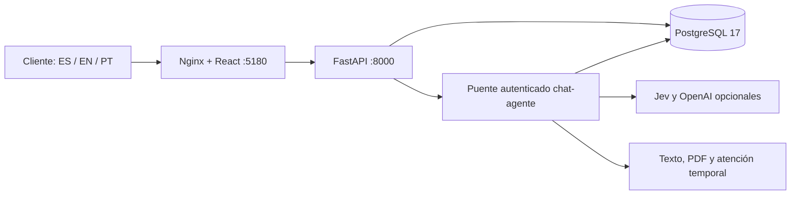

# Arquitectura de Nexqori

Stack elegido por Bryan: **React + FastAPI + PostgreSQL**. TypeScript, Vite y react-i18next en interfaz; SQLAlchemy y Alembic en API. Las versiones efectivas están fijadas en `package-lock.json` y `backend/requirements.lock`.

Web publica 127.0.0.1:5180 y PostgreSQL 127.0.0.1:5433; la API es interna. Dentro de Compose, PostgreSQL utiliza db:5432. Web y API se ejecutan sin root; la API usa el rol PostgreSQL `nexqori_app`, sin superusuario. El volumen `nexqori_postgres_data` conserva los datos al detener/recrear contenedores. La API aplica migraciones y un seed idempotente al arrancar. Cambiar claves en `.env` después del primer arranque no cambia automáticamente las claves persistidas.

## Modelo

| Tabla | Finalidad y límites |
| --- | --- |
| users | Correo único, Argon2, rol cliente/admin, idioma es/en/pt. |
| sessions | Hash de token opaco, token CSRF, caducidad fija de 8 horas. |
| products | Titular, tipo, últimos cuatro dígitos, saldo en unidades menores, moneda MXN. |
| transactions | Titular y producto coherentes por FK compuesta; importe entero y estado. |
| requests | Titular, servicio, movimiento opcional, detalle, clave de idempotencia, estado. |
| audit_events | Actor, fecha y acción: login, logout, solicitud, revisión, derivación, navegación propuesta. |
| messages | Historial anterior por usuario; el nuevo chat no escribe en esta tabla. |

No es un libro mayor: no hay asientos contables, liquidación, conciliación ni operaciones monetarias. El saldo del seed es ilustrativo y no se calcula sumando el historial de ejemplo. Moneda y fecha de presentación pertenecen al escenario de México; elegir portugués o inglés no convierte MXN.

## API

Contrato completo en `/api/openapi.json`.

| Ruta | Permiso y efecto |
| --- | --- |
| GET /api/health | Salud de API y consulta real a PostgreSQL. |
| POST /api/auth/login | Origen permitido, JSON y límites de intentos; crea sesión y auditoría. |
| GET /api/session | Sesión vigente; perfil y CSRF. |
| POST /api/auth/logout | Revoca sesión y borra cookie. |
| PATCH /api/profile/locale | Idioma propio validado. |
| GET /api/bootstrap | Productos, movimientos, solicitudes, mensajes y auditoría propios. |
| POST /api/requests | Cliente, confirmación, idempotencia y movimiento propio si existe. |
| POST /api/requests/{id}/handoff | Cliente titular y confirmación; derivación simulada idempotente. |
| POST /api/assistant | Cliente, CSRF, texto ES/EN/PT; chat-agente opcional, estado por sesión, respuesta, PDF u oferta de atención sin escrituras SQL. |
| GET /api/assistant/documents/{id} | Descarga PDF temporal de la misma sesión/titular, sin escrituras. |
| GET /api/assistant/handoffs | Hilos temporales propios de la sesión. |
| POST /api/assistant/handoffs/{id}/confirm | Cliente + CSRF + confirmed=true; compartir contexto en memoria. |
| POST /api/assistant/handoffs/{id}/messages | Mensaje del cliente al hilo propio compartido; sólo memoria. |
| GET /api/admin/chat-handoffs | Administrador; bandeja de hilos confirmados, sin borradores. |
| POST /api/admin/chat-handoffs/{id}/messages | Administrador + CSRF; asignación al primer operador y respuesta temporal. |
| GET /api/admin/overview | Administrador: usuarios sin hashes, solicitudes y auditoría. |
| POST /api/admin/requests/{id}/review | Administrador y confirmación; recibida → en revisión. |

Las mutaciones autenticadas comprueban CSRF y origen, además del esquema Pydantic (campos extra rechazados). Cookie HttpOnly, SameSite=Lax, token aleatorio almacenado por hash; Secure=false sólo para el HTTP local. No se guardan tokens en localStorage. En HTTPS debe activarse Secure y configurarse el origen concreto.

Se rechazan cuerpos mayores a 16 KB. Los intentos de login se limitan por correo y por IP en memoria de un único worker; detrás del proxy local la IP es compartida. No es un limitador distribuido. Nginx añade CSP y cabeceras de aislamiento; el contrato OpenAPI se entrega como JSON sin depender de un Swagger externo.

## Alcance verificado y siguiente integración

Las pruebas API usan SQLite temporal para aislar casos y validar reglas; la ejecución integral y la persistencia se comprueban sobre PostgreSQL de Docker. Las pruebas de interfaz verifican idiomas, acceso, navegación, solicitudes, derivación, responsive y accesibilidad automatizada. Esto no equivale a una auditoría de seguridad bancaria ni a accesibilidad certificada.

Para producción se necesitan decisiones y servicios específicos: identidad/MFA y recuperación, TLS, gestión de secretos, límites distribuidos, copias/restauración, trazas y alertas, auditoría protegida, integraciones y políticas operativas. El modelo de IA y sus credenciales se conectarán mediante el [contrato de agente](agente.md), sin cambiar la autorización de las APIs.
