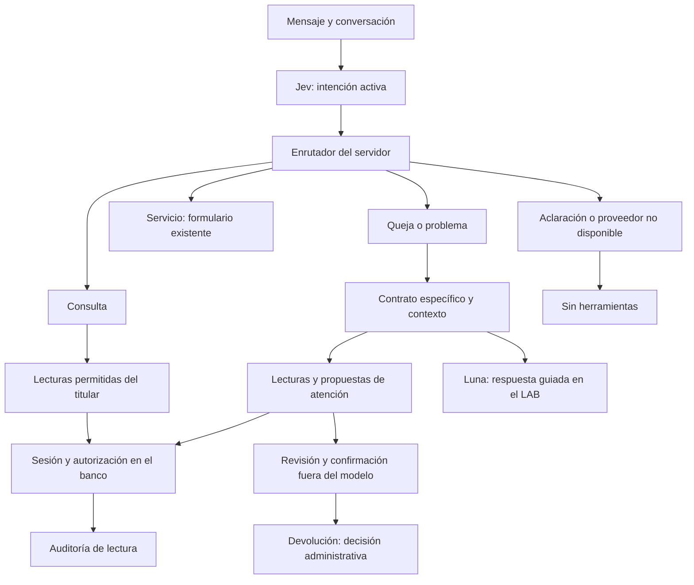

# Jev: consultas, problemas y herramientas

La clasificación interactiva del LAB prepara una ruta por turno. **Jev identifica la intención; el enrutador del servidor selecciona la familia y una lista cerrada de herramientas.** El prompt y las instrucciones personalizadas no pueden añadir herramientas, cambiar al titular ni confirmar operaciones.

La política compartida está en `backend/agent_routing.py`. El LAB la importa sin cargar SQLAlchemy, la base bancaria ni sus credenciales. La taxonomía interactiva conserva 24 intenciones y el benchmark NLP permanece en 345 ejemplos y 23 etiquetas. Esta entrega no mide precisión general de Jev ni calibra umbrales.



## Mapa de rutas

| Intención | Familia | Lecturas disponibles | Preparación, sin ejecución |
| --- | --- | --- | --- |
| account-balance | Consulta | Saldos propios, máximo 20 productos | Ninguna |
| account-activity | Consulta | Últimos 20 movimientos propios, con indicador de más resultados | Ninguna |
| my-cards | Consulta | ID, terminación y estado de tarjetas propias | Ninguna; no PAN/CVV |
| request-status | Consulta | Folio propio, estado, RF y CR si existe | Ninguna; no activa devolución |
| personal-loan, mortgage, investment-inquiry, insurance-inquiry | Consulta | Información del catálogo | Ninguna; no calcula elegibilidad ni contrata |
| unrecognized-charge | Problema | Contrato, folio si existe, movimiento y tarjetas enmascaradas | Solicitud, derivación, revisión de bloqueo y devolución |
| incorrect-charge, payment-status | Problema | Contrato, folio si existe y movimiento | Solicitud, derivación y revisión de devolución |
| app-support | Problema | Contrato, folio si existe y movimiento si corresponde | Solicitud y derivación |
| branch-support, service-feedback | Problema | Contrato y folio si existe | Solicitud y derivación |
| phone-bill, internet-bill, tv-bill, utilities-bill, bank-transfer, cash-withdrawal, cash-deposit | Servicio | Información del catálogo | Formulario existente con revisión |
| needs-clarification, multiple-intents, out-of-scope | Aclaración / alcance | Ninguna | Aclarar o explicar alcance |
| Error de proveedor o etiqueta desconocida | Sin clasificación válida | Ninguna | Reintentar explícitamente |

Una lista permitida no es una secuencia obligatoria. Consultar un folio requiere que exista; no se inventa ni se extrae como identidad autorizada desde el texto. Un reclamo existente se continúa antes de proponer otro. El cliente selecciona referencias de sus registros. Bloquear sólo está propuesto en el procedimiento de cargo no reconocido. La elegibilidad de una devolución se comprueba después en los endpoints bancarios, incluso si figura en el plan.

Cada turno vuelve a calcular la ruta: problema → consulta elimina el contrato y las propuestas de bloqueo/devolución; consulta → problema carga su procedimiento. Un fallo de Jev deja el plan vacío. Las consultas del LAB omiten Luna y orientan a la pantalla del banco; no presentan saldos inventados. En comparación independiente, el plan sigue identificado como propuesta de Jev aunque el LLM discrepe: la decisión de doble validación permanece separada y no ejecuta herramientas.

## Cómo probar la pantalla

1. Actualiza y arranca el [LAB](../experiments/intent-lab/README.md) desde la raíz del repositorio. Abre <http://localhost:5190/>.
2. Elige una conversación o crea una con «Quiero consultar el estado de mi folio». **Ruta y herramientas** antes de ejecutar está marcada **Referencia del caso**; no es inferencia.
3. Pulsa **Ejecutar caso** para comparar Jev/Luna o **Probar respuesta de este caso** para el recorrido conversacional. El panel indica **Propuesta de Jev** con la ruta, lecturas, referencias necesarias y acciones revisables.
4. Continúa con un problema de cobro y luego pide sólo el saldo. El panel cambia con la intención activa del nuevo turno. Si hay ambigüedad, debe mostrar aclaración sin herramientas.
5. Revisa el JSON de salida o el historial. `tool_plan` incluye versión, procedencia, intención, contrato, permisos y pasos. `executed_tools` y `executed_operations` siguen vacíos en la comparación de clasificación. El editor con Contexto bancario registra las lecturas en `executed_tools`, manteniendo vacías las operaciones.

No hay llamadas automáticas a proveedores al abrir la página. Los enlaces bancarios sólo abren pantallas. El editor de flujos incorpora una conexión explícita de lectura, descrita en [Contexto bancario](contexto-bancario-en-flujos.md). El caso de [segunda atención](evaluacion-segunda-atencion.md) sigue disponible. Los registros de ejecución y textos se guardan únicamente en `.local/intent-lab/runs/`.

## Base de ejecución de lectura en el banco

`POST /api/assistant/tools/read` ya implementa las siete herramientas `read-*` de la política. Requiere sesión **cliente**, origen bancario permitido y token CSRF. Cuerpo de ejemplo, dentro de una sesión autorizada:

```json
{
  "intent": "incorrect-charge",
  "tool": "read-transaction-evidence",
  "referenceId": "ID_DEL_MOVIMIENTO_PROPIO",
  "conversationId": "ID_DE_CONVERSACION_PROPIA",
  "locale": "es"
}
```

`conversationId` es opcional. `referenceId` se exige para movimiento o folio, y se rechaza para herramientas sin referencia. El servidor comprueba que conversación y recurso pertenecen al mismo titular; no acepta cambiar el movimiento fijado en una conversación. No admite `userId`, rol, SQL, URLs, importe, contraseña ni confirmación en este contrato. La intención restringe la lista de herramientas; **no demuestra autenticidad de una clasificación ni concede permisos**. Un cliente puede proponer otra intención, pero siempre obtiene sólo lecturas autorizadas propias.

La respuesta devuelve `status: executed`, datos acotados, procedencia y `auditEventId`. Una lectura ejecutada no es una operación financiera ejecutada. Los eventos `tool_*` identifican actor/titular y folio, movimiento o conversación cuando corresponde; no almacenan datos de tarjetas ni la respuesta completa. La escritura de auditoría debe confirmarse antes de responder. Los intentos fallidos no tienen cobertura de auditoría completa en esta base.

El gateway rechaza todas las herramientas `prepare-*` y cualquier nombre libre. Preparar acciones en el LAB significa mostrar lo que se puede revisar en el banco. El registro de solicitud, derivación, bloqueo y devolución conserva sus endpoints con confirmación, idempotencia y titularidad. El bloqueo exige contraseña. Una devolución sólo abona tras la revisión y aprobación administrativa, siempre a la cuenta del mismo titular. Véase [acciones de problemas](acciones-problemas.md).

## Límite de integración

El chat bancario sigue guiado y su botón **Preguntar por este movimiento** consulta registros propios actualizados. Jev y Luna permanecen en el LAB. Su editor puede consultar registros mediante la sesión bancaria del titular y una selección explícita de movimiento. Las lecturas pasan por el gateway existente; no se envían tokens ni respuestas bancarias a modelos. La biblioteca del editor conserva su alcance de operador local y todavía no hay adaptador Jev en el chat bancario. Un plan JSON nunca autoriza operaciones.

La evidencia de movimientos procede de Nexqori; no hay logs de un procesador o emisor externo. No se ha añadido captura de voz, aprobación por mensajes ni operaciones financieras automáticas.

## Verificación reproducible

Desde la raíz, con los entornos existentes:

```powershell
.venv-app/Scripts/python.exe -m pytest backend/tests -q
$env:PYTHONPATH = "$PWD/experiments/intent-lab"
.local/intent-lab-venv/Scripts/python.exe -m pytest experiments/intent-lab/tests -q
npm test
npm run build
node node_modules/typescript/bin/tsc -p experiments/intent-lab/tsconfig.json --noEmit
node node_modules/vite/bin/vite.js build --config experiments/intent-lab/vite.config.ts
node experiments/intent-lab/check-routing-ui.mjs
```

La comprobación UI exige el LAB en 5190; usa respuestas controladas con el plan real del servidor, sin consumir proveedores ni escribir conversaciones. Los tests API verifican titularidad, rol, CSRF/origen, referencias, exclusión de herramientas financieras y saldos intactos. Los tests del LAB comprueban cambios por turno, fallos de proveedor y separación de contratos.
