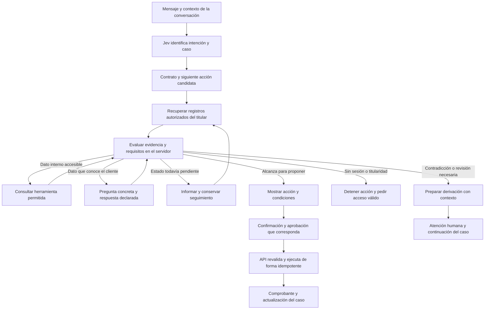

# Flujo de evidencia y escalamiento de Nexqori

Propuesta del 1 de octubre de 2026 para Bryan y el equipo, contrastada con la revisión `80ead68`. Define cómo decidir qué consultar, qué preguntar y cuándo detener una acción. Es un diseño para la siguiente integración; el evaluador descrito aquí todavía no está implementado.

La recomendación es un módulo de **evaluación de evidencia por acción** en FastAPI, con estado en PostgreSQL y una vista de evaluación en el LAB. La intención selecciona el procedimiento; sus reglas determinan qué evidencia necesita cada paso. Los modelos ayudan a interpretar el relato y redactar preguntas. La autorización y elegibilidad de las operaciones siguen en el servidor.

## Cambio propuesto al diagrama

El diagrama aportado mezcla la clasificación de intención con la suficiencia de evidencia. Son resultados distintos. Saber que el cliente reclama un cobro con alta confianza no demuestra que haya un error, que el pago esté completado o que proceda un abono. La suficiencia debe expresarse **para una acción**, con fuentes y condiciones pendientes; no como un único porcentaje.



Las flechas de consulta y preguntas requieren límites de reintentos y conservación de lo ya respondido. Una espera se reanuda con un nuevo turno o evento autorizado; no debe convertirse en un bucle de consultas continuas. La derivación con responsable y continuación es parte del diseño: hoy sólo se registra `handed_off`.

## Qué puede obtener el bot y qué necesita preguntar

La columna automática describe datos que **ya tienen herramientas de lectura**, pero cuya selección/ejecución desde Jev sigue pendiente. No implica que el LAB acceda hoy a las cuentas.

| Caso | Datos consultables del mismo titular | Información declarada que puede faltar | Condición para el siguiente paso y límite |
| --- | --- | --- | --- |
| Cargo no reconocido | Movimiento, producto asociado, tarjeta enmascarada/estado, folio y devolución existentes | Elegir movimiento si es ambiguo; qué desconoce y qué ayuda solicita | Puede proponer proteger una tarjeta propia activa con confirmación y contraseña. No exige demostrar fraude para proponer protección. Registrar/revisar el reclamo y devolver dinero son decisiones separadas. |
| Cobro incorrecto o duplicado | Cargo, importe, moneda, estado, folio/devolución; movimientos propios como candidatos | Importe esperado, referencia del segundo cargo o explicación/comprobante de cancelación | Dos importes iguales no prueban duplicación. La devolución completa se solicita sólo sobre un cargo elegible; el abono requiere administrador. Comparación de dos cargos y adjuntos verificados son ampliaciones. |
| Pago incierto, pendiente o rechazado | Estado actual registrado, importe/referencia, solicitud y eventos de gestión | Qué pantalla falló, momento aproximado y qué observó el cliente, si hace falta para investigar | Puede explicar el estado. Pendiente/rechazado no admite devolución. Si falta una fuente de liquidación o el cliente contradice el registro, conservar la diferencia y derivar para revisión; no inventar el desenlace ni recomendar pagar otra vez sin verificar. |
| Error de aplicación | Información del servicio y, si está identificado, movimiento propio relacionado | Pantalla, acción, hora, canal/versión y mensaje de error no sensible | Si afecta dinero, evaluar también el estado de pago. Sin telemetría operativa no puede atribuir una causa técnica; registrar incidencia y derivar cuando se requiera diagnóstico. |
| Atención en sucursal | Procedimiento y folio propio, si existe | Sucursal declarada, fecha aproximada, servicio, relato y resultado buscado | Registrar el relato y preparar atención. No hay fuente que verifique automáticamente una visita o lo ocurrido en ella. |
| Calidad de servicio | Procedimiento y seguimiento de una solicitud conocida | Canal, motivo, contexto y resultado esperado | Registrar opinión/reclamo y evitar duplicar un folio conocido. No habilita compensación automática. |
| Seguimiento de reclamo | Estado de folio, RF/CR y auditoría de gestión propia | Seleccionar folio cuando no esté identificado | Es consulta: resumir datos disponibles y siguiente paso. No crear otro reclamo ni cargar instrucciones de devolución por defecto. |

El saldo, el estado de un cargo y la titularidad deben obtenerse del servidor cuando están disponibles. El bot no debe pedir al cliente que los vuelva a escribir como si ese relato verificara el registro. La preferencia de ayuda o experiencia digital puede adaptar la explicación; no cambia permisos ni requisitos de una operación.

## Cómo combinar los datos

En la base operativa de Nexqori se pueden construir lecturas acotadas por la sesión:

| Relación | Unión y propósito |
| --- | --- |
| Producto y movimiento | `products.id = transactions.product_id`, mismo `user_id`: identificar el producto del cargo. |
| Movimiento y solicitud | `transactions.id = requests.transaction_id`, mismo `user_id`: recuperar su folio, sin crear otro. |
| Solicitud y devolución | `requests.id = refunds.request_id`, mismo `user_id`: revisión RF, decisión y posible CR. |
| Tarjeta y cuenta de abono | `card_profiles.product_id` y `settlement_product_id`, mismo titular: cuenta explícitamente asociada, no la primera disponible. |
| Conversación y movimiento | `conversations.transaction_id`, con titular validado: reanudar el contexto correcto. |
| Auditoría y recursos | Filtrar por titular y referencias reales de solicitud, producto o conversación. RF se obtiene desde la devolución del folio; no existe un campo RF directo en todos los eventos. |

`transaction_evidence` ya reúne movimiento, solicitud, devolución y hasta 20 eventos de gestión del reclamo. Su indicador `externalProcessorLogs: false` distingue estos registros de logs de autorización, intentos o liquidación bancaria externa. Esos logs no están conectados.

El dataset histórico no se debe unir indiscriminadamente para alimentar sesiones. El [análisis de servicios](servicios-basados-en-datos.md) documenta discrepancias de titular en los 44.570 enlaces reclamo–producto informados y en casi todos los enlaces evento–producto comparables. La relación transacción–producto–cliente sí concordó en el censo analizado. Son hallazgos previos, no un análisis repetido en esta revisión. Las relaciones incoherentes deben excluirse o pasar a revisión, conservando el origen; no repararse adivinando por nombre, importe o fecha.

Los fixtures coherentes de [los tres casos](pruebas-tres-casos.md) sirven para desarrollar este flujo. Un ETL futuro debe producir derivados analíticos separados; no cargar el dataset como cuentas o evidencia operativa verificada.

## Datos verificados y afirmaciones del cliente

Cada dato del contexto necesita valor, fuente, referencia, momento de lectura y condición: `verified`, `declared`, `missing`, `conflicting` o `unavailable`. La marca `verified` sólo puede asignarla el adaptador de una fuente autorizada. Un texto pegado, una instrucción personalizada o una respuesta del modelo no puede asignársela.

Por ejemplo, «el comercio canceló la compra» es una afirmación del cliente; `transactions.status = completed` es el registro local consultado. Ambos se conservan sin reemplazarse. Que el banco registre el cargo no refuta automáticamente una cancelación comercial; deja una cuestión que requiere evidencia o revisión.

La fecha del movimiento no equivale a la fecha de consulta. El adaptador debe registrar `observed_at` y, si existe, versión/actualización de la fuente. Antes de escribir, la API vuelve a comprobar estado, titularidad, importe y destino. Una lectura antigua o un resultado de timeout nunca se interpreta como ausencia de cargo.

## Qué devuelve el evaluador

La salida debe incluir decisión, acción evaluada, datos faltantes separados por origen, contradicciones, fuentes usadas, razones legibles y condiciones de confirmación/aprobación. Propuesta de decisiones:

| Decisión | Significado |
| --- | --- |
| `fetch_evidence` | Falta un dato que una herramienta permitida puede obtener; consultar antes de preguntarlo. |
| `ask_customer` | Falta una selección o información que sólo el cliente puede aportar; una pregunta concreta. |
| `wait_for_state` | Hay un proceso o fuente pendiente; conservar el caso y reconsultar con un nuevo evento/turno. |
| `ready_to_propose` | Alcanza para ofrecer una acción específica; todavía no autoriza ejecutarla. |
| `human_review` | Hay una aprobación reservada al administrador, contradicción relevante o límite que necesita atención. |
| `stop` | Sesión/permisos inválidos o dato ajeno. No revelar si existe un recurso de otra persona. |

Si existen varias acciones, se evalúan por separado. Para un cargo no reconocido pueden coincidir `ready_to_propose` para el bloqueo y `human_review` para la disputa. Una referencia ajena detiene esa acción, sin impedir ayuda genérica sobre el procedimiento.

Ejemplo de salida propuesta, con referencias ilustrativas:

```json
{
  "policy_version": "proposed-v1",
  "intent": "incorrect-charge",
  "evidence_refs": ["own_transaction", "own_request", "settlement_account"],
  "customer_statements": ["merchant_cancelled_purchase"],
  "actions": [
    {
      "action": "request_refund_review",
      "decision": "ready_to_propose",
      "missing_system": [],
      "missing_customer": [],
      "required_gates": ["customer_confirmation", "idempotency"],
      "reason": "Cargo propio completado y cuenta asociada; puede solicitar revisión."
    },
    {
      "action": "approve_refund",
      "decision": "human_review",
      "required_gates": ["refund_requested", "administrator_review", "reauthentication", "confirmation", "idempotency"],
      "reason": "La cancelación comercial no está verificada y el abono requiere aprobación administrativa."
    }
  ],
  "authorizes_execution": false
}
```

El ejemplo es diseño, no un endpoint existente. Tampoco es un JSON que se acepte como autorización desde el cliente o desde un modelo.

## Papel de Jev y del LLM

Jev conserva la clasificación de intención. El LLM puede proponer datos extraídos del relato, identificar ambigüedades y redactar una pregunta usando los faltantes determinados por la política. Los contratos y el servidor deciden elegibilidad y permisos. NLP permanece como comparación básica en el benchmark.

Si queremos comparar Jev y LLM clasificando suficiencia, necesitaremos **otra tarea y otro conjunto etiquetado**: contexto, acción candidata, evidencia con procedencia, regla y decisión esperada. El buen resultado de Jev en intención no demuestra precisión en esta segunda tarea. Su distribución o confianza tampoco es una probabilidad validada de que un abono sea correcto. El acuerdo entre ambos modelos puede ser una señal a estudiar; no reemplaza las condiciones del servidor.

Hoy Luna ya devuelve `next_step` y `missing_information` en el LAB. Recibe `unverified_context`; todavía no tiene un paquete de evidencia bancaria verificada ni estado estructurado suficiente para resolver esta decisión. La ampliación consiste en comprobar hechos y requisitos, no sólo en añadir más instrucciones al prompt.

## Estado y derivación

El caso debe conservar intención activa, recursos elegidos, datos/fuentes, preguntas realizadas y respuestas, acción pendiente, decisiones anteriores y versión de contrato/política. Para la base propongo tablas separadas de estado y evaluaciones por turno, vinculadas a titular, conversación y folio cuando exista. Los nombres y la migración se concretan al implementar; las tablas actuales de conversaciones y solicitudes no contienen este estado completo.

Al escalar, entregar un paquete con motivo y destino de atención, resumen fiel, referencias NQ/RF/CR cuando existan, hechos consultados, afirmaciones no verificadas, contradicciones, preguntas ya respondidas y siguiente decisión requerida. Registrar recepción y responsable permitirá distinguir derivación solicitada de atención aceptada. La disponibilidad de una cola o especialista real sigue pendiente.

No todo faltante requiere escalar: primero consultar la fuente disponible o preguntar al cliente. Escalar cuando la fuente necesaria no existe, la discrepancia sigue sin aclararse, la decisión exige un administrador o el usuario pide atención humana. Un fallo transitorio puede llevar a reintento acotado/espera; no a negar automáticamente el reclamo.

## Dónde encaja Airflow

Para este evaluador recomiendo FastAPI + PostgreSQL: reutiliza sesión, políticas, herramientas y formularios existentes. Separar el módulo lógico no obliga a desplegar otro servicio. La espera entre mensajes/aprobaciones se guarda como estado, sin mantener una petición HTTP abierta.

Airflow encaja en **lotes con dependencias**, por ejemplo `ingesta → validar relaciones → transformar derivados → ejecutar casos reservados → publicar métricas`. Su documentación contempla cargas de IA y workflows por lotes. Esta es una recomendación de encaje para Nexqori, no una incapacidad de Airflow para ejecutar Python o modelos. [Documentación oficial de Airflow](https://airflow.apache.org/docs/apache-airflow/stable/index.html).

Airflow también ofrece tareas que esperan decisiones humanas; por eso no sería correcto descartarlo diciendo que no admite aprobaciones. Aun así, trasladar cada turno y la autorización bancaria a su infraestructura añadiría componentes y una segunda gestión de estado para un flujo que ya tiene API y base. Mantendría la aprobación bancaria en sus endpoints actuales. [Aprobaciones humanas](https://airflow.apache.org/docs/apache-airflow/stable/tutorial/hitl.html), [arquitectura](https://airflow.apache.org/docs/apache-airflow/stable/core-concepts/overview.html).

Un DAG de evaluación no debe repetir operaciones sobre las cuentas habituales al reintentarse: usar un entorno/caso aislado, identificadores persistentes por ejecución e idempotencia. El volumen de DAGs o la adopción de una herramienta no sustituye la calidad de las reglas y evidencias.

## Qué construir primero

1. Ampliar los contratos con requisitos **por acción**, fuente de cada dato, incompatibilidades y criterio de derivación. Los actuales `requiredFields` validan un formulario; no constituyen por sí solos una política de evidencia.
2. Construir el adaptador de lecturas y el evaluador determinista, empezando con las tres familias ya probadas. En el LAB, usar primero evidencia de fixtures identificada como tal; conectar la sesión bancaria mediante un adaptador explícito y acotado.
3. Persistir el estado por caso y añadir al LAB el panel **Evidencia y siguiente paso**: datos consultados, origen, faltantes, pregunta propuesta, acción elegible, aprobaciones pendientes y razón de derivación. Mantener ES/EN/PT y la diferencia entre propuesto y ejecutado.
4. Conectar propuesta, confirmación en formulario y comprobante de la API. Después añadir recepción/asignación de la derivación y continuidad del caso.
5. Evaluar las variantes antes de añadir Airflow para programar lotes. Es orden recomendado de implementación, no trabajo ya realizado en esta revisión.

Por cada uno de los tres casos, probar al menos: datos completos, movimiento sin seleccionar, contradicción y fuente fallida/no disponible. Son 12 escenarios de partida, con ES/EN/PT como traducciones del mismo caso. Conservar casos reservados y comparar todos los métodos sobre la misma información, política y acción; no filtrar desenlaces futuros hacia la entrada.

Medir decisión correcta, operaciones indebidas, escalamiento omitido/innecesario, preguntas redundantes, turnos y tiempo por etapa. Separar espera del cliente/administrador, fallos de fuentes y latencia de modelos. Las 9 pruebas operativas anteriores prueban los formularios y efectos; aún no validan este evaluador ni su automatización.

## Referencias del proyecto

- [Plan de herramientas](../backend/agent_routing.py) y [gateway de lecturas](../backend/agent_tools.py).
- [Paquete actual de registros de movimiento](../backend/transaction_context.py), [operaciones y aprobación](../backend/operations.py) y [contratos](../backend/workflow_catalog.json).
- [Diálogo actual Jev y Luna](../experiments/intent-lab/intent_lab/dialogue.py), [arquitectura del banco](arquitectura.md), [calidad y alcance de los datos](servicios-basados-en-datos.md) y [mapa completo](mapa-flujo-y-plan-pruebas.md).
