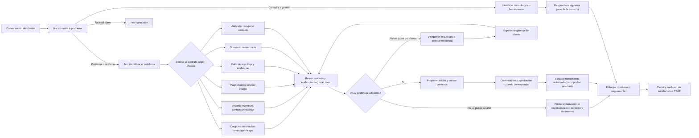

# Flujo maestro de atención de Nexqori

El [chat del banco](chat-bancario-y-pagos.md) reutiliza este motor desde el 2 de octubre. El editor conserva sólo propuestas; la app añade confirmación explícita para registrar el reclamo y un pago local separado del flujo.

Referencia acordada con Bryan el 1 de octubre de 2026 (America/Lima): diagrama compartido en esta conversación y sus correcciones posteriores. Este documento conserva el recorrido funcional; es la referencia para las siguientes ediciones del editor.

## Reglas que deben conservarse

- **Un solo flujo para todos los casos**. Elegir un caso cambia conversación y parámetros, no sustituye el diagrama ni crea un flujo por categoría. El bloque Contrato carga la configuración correspondiente a la clasificación real.
- **Flujo completo** guarda, valida y ejecuta desde el punto pendiente; **Paso a paso** usa ese mismo estado. Los errores de conexión se muestran explícitamente.
- Seleccionar un bloque muestra su último resultado, sin recalcular ni perder el avance. Mover, renombrar, guardar el diseño o inspeccionar otra rama tampoco ejecuta pasos. Sólo **▶** recalcula el bloque solicitado con sus entradas guardadas; conserva los resultados previos y continúa desde su nueva derivación. La ejecución anterior permanece consultable.
- Los 24 casos se muestran subdivididos dentro de la clasificación: seis problemas, ocho consultas, siete servicios y tres aclaraciones. Ver o buscar una categoría no cambia el caso en ejecución. La selección inicial de consulta/problema y los alcances de cada clasificador permanecen separados.
- Clasificar **consulta o problema antes de identificar el problema concreto**. Sólo la rama de problema carga el procedimiento de problemas. Las solicitudes de servicios conservan sus herramientas propias dentro de consultas/gestiones.
- Recibir el mensaje y su conversación previa antes de clasificar. El caso de ejemplo elegido no impone la respuesta de Jev.
- En **Preguntar lo que falta**, detener la ejecución para recibir un mensaje real o seleccionar la referencia bancaria pendiente. Actualizar el contexto y volver a comprobar lo que falta; nunca avanzar por un bucle automático sin respuesta ni repetir Jev por cada dato.
- Distinguir **datos declarados completos** de **evidencia bancaria suficiente**. Tener fecha e importe no confirma un cobro, su titularidad ni el derecho a devolución.
- Cuando no se pueda obtener o aclarar la evidencia, preparar la derivación con contexto y pendientes. No afirmar que un especialista fue contactado si sólo se preparó el paquete.
- El avance por pasos y el flujo completo deben usar el mismo motor, las mismas condiciones y el mismo estado. El operador no puede forzar la rama contraria ni omitir requisitos desde un botón.
- Confirmación, titularidad, permisos, idempotencia y auditoría se aplican en servidor. Las devoluciones requieren revisión y aprobación administrativa. Un resultado del modelo nunca autoriza la operación.
- Mostrar qué acción se ejecutó, cuál sólo se propuso y qué está pendiente. Conservar folio de seguimiento cuando realmente exista.
- En el editor actual, los bloques de acción, especialista, resultado y cierre muestran **Se activaría**: nombre de función, requisitos y `executed: false`. El recorrido prepara un plan; los disparadores del diagrama no ejecutan operaciones, avisos ni contacto externo. Las propuestas de satisfacción y participación requieren cierre confirmado y adaptadores aún pendientes.

## Casos de la imagen y correspondencia

| Caso de la imagen | Tratamiento |
| --- | --- |
| No reconoce el movimiento/transacción | Investigar cargo, titularidad y posible riesgo; contrato `unrecognized-charge`. |
| Cuestiona el importe | Contrastar importe esperado, cargo e histórico; contrato `incorrect-charge`. |
| Pago dudoso o error de la app al pagar | Separar estado del intento (`payment-status`) del fallo técnico (`app-support`); consultar los registros correspondientes. |
| Seguimiento de reclamo | Recuperar historial y pendientes por folio. Es consulta `request-status` si no se reporta un problema nuevo. |
| Atención en sucursal / experiencia de atención | Conservar los contratos `branch-support` y `service-feedback`, presentes en el dataset y el alcance. |

## Estado e integraciones

El editor local implementa el flujo común de 24 bloques, derivación inicial, seis ramas de contrato visibles, contexto declarado, ejecución por pasos, trazas y retorno conversacional. Las instrucciones/preguntas del caso se capturan al cargar el contrato y se conservan en la continuación. Cada contrato enumera las lecturas que necesitaría. Contexto separa las citas declaradas de los datos consultados mediante la sesión del titular, con selección de movimiento, folios de auditoría y preguntas por lo que falta. La clasificación y derivación inicial son un solo bloque de tres salidas. Para app se muestran correlación de logs y aviso condicionado a un error verificado, sin ejecutarlos. La plantilla separada Incidencia de la app conserva la comprobación y aviso locales cuando se elige expresamente. Los ejemplos conversacionales están redactados a partir de categorías, no son transcripciones auténticas de clientes.

La aplicación bancaria tiene lecturas autenticadas, bloqueo propio y devolución con aprobación administrativa; **el editor consulta los registros del titular cuando se conecta expresamente su sesión; todavía no ejecuta operaciones financieras**. La [guía de contexto bancario](contexto-bancario-en-flujos.md) explica cómo probarlo y distingue eventos internos de logs técnicos pendientes. El [evaluador de evidencia y escalamiento](flujo-evidencia-y-escalamiento.md) describe la integración que falta. Evidencias adjuntas, contacto efectivo con especialista, entrega externa del paquete y CSAT/gamificación del diagrama requieren sus adaptadores y validación; no deben representarse como operaciones terminadas.

La voz queda aplazada hasta nueva indicación de Bryan, confirmado de nuevo el 1 de octubre de 2026. No se conecta GPT-Live ni se activa el micrófono. La prueba actual es escrita. Instrucciones para usar el editor: [Flujos de atención](editor-flujos-lab.md).
