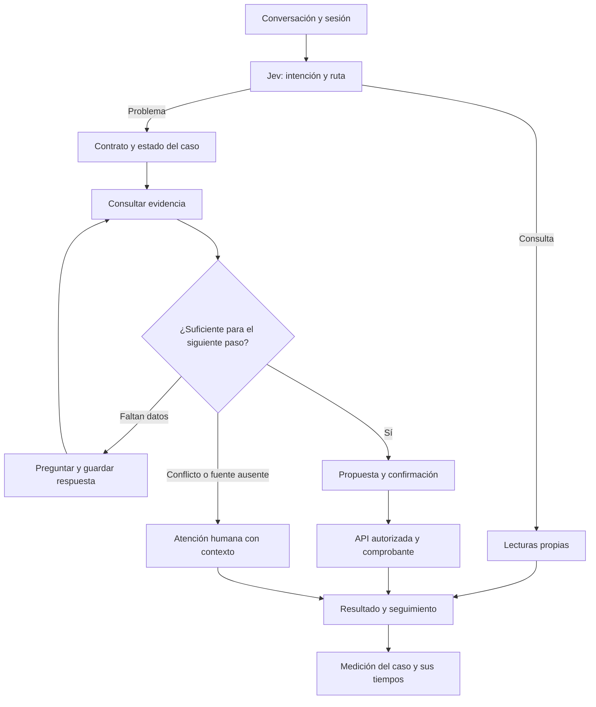

# Flujo completo: brechas y plan de pruebas

Revisión: 1 de octubre de 2026, America/Lima. Código inspeccionado en `bryan`, revisión `ca5f2e7`. Este documento propone el siguiente trabajo; no afirma que esas ampliaciones estén implementadas ni inicia su ejecución.

Ampliación posterior solicitada: la [guía de tres casos reproducibles](pruebas-tres-casos.md) añade un ejecutador de operaciones desde frontend y un paquete manual nuevo. Comprueba bloqueo, devolución aprobada y derivación en ES/EN/PT. La integración automática de Jev/Luna con esas operaciones continúa pendiente.

El [diseño de evidencia y escalamiento](flujo-evidencia-y-escalamiento.md) desarrolla cómo consultar datos, preguntar, esperar, proponer o derivar según cada acción, y distingue ese módulo conversacional de los pipelines por lotes que podría coordinar Airflow.

## Decisión recomendada

Podemos probar clasificación, respuestas por procedimiento y operaciones bancarias por separado. Para observar cómo el asistente resuelve un caso de principio a fin falta conectar la conversación con lecturas autorizadas, conservar el estado del procedimiento y verificar el resultado de cada acción. La confianza de Jev no sustituye esas comprobaciones.

Primer recorrido integrado recomendado: **cobro incorrecto → evidencia del movimiento → solicitud de devolución → aprobación o rechazo administrativo → resultado y seguimiento**. Incluye un desenlace normal, información insuficiente y una decisión humana. Después se reutiliza el mismo mecanismo para los demás problemas.

Se conserva el alcance acordado: modelos en el LAB primero. Para probar herramientas, añadir un adaptador de evaluación con sesión autenticada y registros coherentes de prueba en un entorno aislado. Llevar ese adaptador al chat bancario habitual es una decisión posterior; el LAB no debe recibir credenciales delegadas ni permisos generales sobre las cuentas actuales.

## Qué podemos probar ahora

| Prueba | Disponible | Qué no demuestra todavía |
| --- | --- | --- |
| Clasificación independiente Jev y Luna | Caso manual, distribución de Jev, latencia, consumo y salida estructurada | Precisión general, calibración o que una clasificación correcta resuelva el caso |
| Conversación Jev → contrato → Luna | Seis procedimientos; instrucciones por caso; ruta recalculada por turno | Lectura bancaria ejecutada o acción realizada desde el LAB |
| Lecturas bancarias | Siete herramientas con sesión, titularidad, CSRF y auditoría; contexto por movimiento en el chat guiado | Investigación de procesador/emisor externo ni evidencia enviada automáticamente al LLM |
| Operaciones locales | Bloquear tarjeta; solicitar devolución; administrador aprueba o rechaza; abono e idempotencia | Conexión automática entre diálogo, propuesta, confirmación y resultado |
| Seguimiento | Folio NQ, operación RF, abono CR y auditoría; búsquedas por referencia | Motor de resolución general ni agenda/asignación de un especialista |
| Benchmark | Dos baselines NLP sobre lote congelado; llamadas manuales a proveedores | Runner equivalente por lotes para Jev/LLM/combinado o éxito de resolución |

Comprobación operativa de esta revisión: los endpoints locales del banco y LAB no respondieron; Compose no mostró servicios activos y no se encontró el proceso del LAB en 5190. Esto no invalida la implementación anterior, pero impide usar sus pantallas hasta arrancarlos. No se arrancaron servicios ni se repitieron tests o proveedores en esta revisión.

Para retomar en este equipo: seguir [INICIO-EQUIPO](../INICIO-EQUIPO.md) (`npm run docker:up`, conservando el volumen) y el [arranque del LAB](../experiments/intent-lab/README.md#arranque-local-desde-la-raíz-del-repositorio). No rehacer el seed, borrar el volumen ni restablecer las cuentas habituales para repetir casos.

## Mapeo del diagrama

**Disponible** significa que existe código para esa pieza; **parcial** que sólo cubre parte del paso; **falta** que el recorrido propuesto necesita una ampliación. No representa porcentaje de avance.

| Paso del diagrama | Estado comprobado | Ampliación necesaria | Prioridad propuesta |
| --- | --- | --- | --- |
| Conversación de texto y contexto del cliente | Disponible en banco y LAB por separado; idiomas y perfil de ayuda existen | Unir conversación, sesión de evaluación y contexto mínimo autorizado; mantener idioma y hechos entre turnos | P0 |
| Clasificar consulta o problema | Disponible con Jev en LAB | Usar esa ruta dentro de un procedimiento persistente; no perder el caso al cambiar de tema | P0 |
| Investigar cargo / contrastar importe / recuperar seguimiento | Lecturas y registros propios disponibles; comparación e investigación limitadas | Elegir referencia propia, ejecutar lectura y entregar al asistente hechos con fuente/fecha; incorporar comparación de dos cargos cuando aplique | P0; comparación ampliada P1 |
| Comprobar pago o intento en logs | Estado transaccional y eventos de gestión propios disponibles | Distinguirlos de intentos, autorización o liquidación externa, que no están conectados. Para pruebas, representar estados conocidos sin inventar logs | P0 para estado local; integración externa posterior |
| ¿Hay evidencia suficiente? | Controles de elegibilidad en acciones; no existe motor completo de evidencia conversacional | Reglas por procedimiento: datos requeridos, estados compatibles, hechos verificados, contradicciones y siguiente paso permitido | P0 |
| Preguntar / recibir evidencia / volver a evaluar | Luna puede preguntar y recibir texto declarado | Persistir campos faltantes y respuestas; no repetir pasos ya hechos. Notas estructuradas primero; adjuntos con referencia y controles después | P0 para datos estructurados; P2 para archivos |
| Proponer acción y validar permisos | APIs con permisos, confirmación, contraseña cuando corresponde e idempotencia | Propuesta vinculada a recurso y operación concreta; confirmación en formulario; retomar conversación sólo con resultado del servidor | P0 |
| No se puede aclarar → especialista | Derivación local `handed_off` y revisión administrativa | Paquete de contexto, pendientes, responsable y cola de atención; acuse y continuación. Agenda/llamada real pertenece a otra ampliación | P1 para cola y contexto; P3 para agenda |
| Entregar resultado y seguimiento | Estados de devolución y comprobantes disponibles | Resumen fundado en ejecución, desenlace general del caso y verificación posterior. Registrar una solicitud no equivale a resolverla | P0 para comprobante; P1 para ciclo completo |
| Cierre y satisfacción | Sin cierre general/CSAT en el modelo inspeccionado | Criterio de cierre por tipo de caso, motivo, evidencia, confirmación y encuesta opcional | P1 para cierre; P2 para CSAT |
| Voz y gamificación | Llamada visual sin motor; gamificación no implementada | Mantener después del flujo de texto y de la evaluación de resultados | P3 |

Los estados actuales de `requests` son `received`, `in_review` y `handed_off`. Los de devolución son `pending`, `approved` y `rejected`. Un abono aprobado no cambia por sí solo el estado general del reclamo. La ampliación de cierre necesitará un contrato de transición y migración propios.

Recorrido objetivo, con las conexiones pendientes descritas en la tabla:

El seguimiento exclusivo de folio ya es `request-status`, familia consulta. No debe activar un contrato de problemas. Una nueva queja sobre el resultado puede volver al procedimiento correspondiente conservando el mismo folio.

## Orden de construcción y condición para avanzar

| Orden | Entregable propuesto | Se considera listo cuando… |
| --- | --- | --- |
| 0 | Entornos accesibles y casos aislados | Banco/LAB responden; cada prueba usa un titular y registros identificados, con preparación repetible y sin modificar las cuentas habituales |
| 1 | Adaptador conversación → herramienta → respuesta | Un diálogo en el LAB de evaluación consulta un movimiento propio y Luna responde sólo con esos hechos; referencias ajenas, sesión vencida y herramienta no permitida se rechazan |
| 2 | Estado del procedimiento y puerta de evidencia | Se conserva folio, paso, datos conocidos/faltantes y acciones ya realizadas; información insuficiente pregunta, contradicción detiene y deriva, información suficiente permite preparar la acción |
| 3 | Recorrido completo de cobro incorrecto | Confirmación explícita crea RF pendiente; decisión administrativa produce rechazo o un único CR; al retomar el chat, el resultado coincide con la base y existe una traza completa |
| 4 | Ejecutador de casos y medición | Un lote repetible registra expectativas, resultados, tiempos, errores y cambios de datos; una respuesta convincente sin efecto esperado falla la prueba |
| 5 | Resto de problemas y atención humana | Cada caso tiene evidencia mínima, resultado permitido y condición de derivación; sucursal/calidad/app no se declaran resueltos por haber creado un folio |
| 6 | Comparación de versiones y experiencia | Se comparan prompts/modelos con el mismo lote reservado; después se agregan adjuntos, CSAT y personalización contextual si mejoran el recorrido |

La instrumentación debe comenzar en el paso 1, no añadirse al final. El panel de resultados puede construirse en el paso 4 usando esas trazas.

## Qué debe hacer el motor de procedimiento

Los contratos actuales describen pasos, campos y acciones, y las APIs aplican reglas locales. Falta un coordinador que avance según el resultado de las herramientas y los datos que realmente están disponibles.

Estados conversacionales propuestos, separados del estado financiero: `identificando`, `consultando_evidencia`, `esperando_datos`, `listo_para_proponer`, `esperando_confirmacion`, `esperando_administrador`, `derivado`, `resultado_verificado`. Su adopción requerirá diseño de esquema y pruebas; no son estados activos hoy.

- Guardar hechos verificados con herramienta, referencia y fecha de lectura; mantener aparte lo declarado por el cliente.
- Elegir el siguiente paso permitido desde el estado del caso. El modelo puede proponer preguntas, pero no modificar permisos ni saltarse una confirmación.
- Mantener la referencia al caso aunque aparezca una consulta intermedia. Un cambio de intención no debe borrar evidencias o decisiones ya registradas ni seguir ejecutando las acciones del tema anterior.
- Aplicar límites configurables de turnos y llamadas. Evitar bucles de preguntas, reintentos de escritura y diagnósticos basados sólo en palabras clave.
- Si una acción requiere consentimiento, mostrar el resumen concreto y usar el endpoint existente desde la sesión. No interpretar «sí» fuera de contexto ni texto de una transcripción como confirmación vinculada.
- Después de una operación, leer su resultado persistido. Sólo entonces redactar el comprobante o el siguiente paso.
- Al volver tras una aprobación administrativa, refrescar el estado; no reutilizar la fotografía antigua del caso.

La pregunta «¿evidencia suficiente?» significa **suficiente para el siguiente paso permitido**, no necesariamente suficiente para probar fraude, declarar duplicación o aprobar un reembolso. Un cargo completado puede permitir solicitar revisión sin justificar todavía el abono.

## Primer lote propuesto: 12 escenarios, ES/EN/PT

36 conversaciones por versión, agrupadas en 12 familias; sus traducciones no son observaciones independientes. Son escenarios de evaluación diseñados, con fixtures coherentes. Las transcripciones originales disponibles son consultas de saldo y no permiten presentar estos reclamos como conversaciones auténticas del dataset.

| # | Escenario | Desenlace que debe verificarse |
| --- | --- | --- |
| 1 | Cobro incorrecto reconocido, revisión aprobada | Misma cuenta del titular, una RF y un CR; saldo aumenta exactamente una vez |
| 2 | Cobro incorrecto, revisión rechazada | Motivo y estado rechazado; ningún CR ni cambio de saldo |
| 3 | Cargo no reconocido con decisión de bloquear | Consentimiento y contraseña fuera del chat; tarjeta propia bloqueada; no se afirma fraude probado |
| 4 | Pago con error de pantalla pero movimiento completado | Informar el estado verificado; no recomendar duplicar el pago; revisión sólo si el cliente la solicita |
| 5 | Error de app sin efecto monetario | Recoger contexto específico y registrar/derivar; sin prometer una reparación técnica que no ocurrió |
| 6 | Atención en sucursal | Conservar relato y evidencia como declaraciones; registrar y derivar con folio, sin compensación automática |
| 7 | Calidad del servicio | Registrar resultado buscado y folio; no confundir una opinión con devolución autorizada |
| 8 | Consulta exclusiva del estado de un folio | Leer solicitud propia; no abrir otra ni cargar herramientas de devolución |
| 9 | Reclamo recurrente con pasos anteriores ya realizados | Mantener folio y contexto; no repetir instrucciones ni duplicar caso |
| 10 | No se sabe qué movimiento está afectado | Pregunta concreta/selección de movimiento; ninguna escritura antes de identificarlo |
| 11 | Datos declarados contradicen los registros | Exponer la diferencia y preparar revisión humana; no convertir una afirmación del cliente en hecho verificado |
| 12 | Problema → consulta de saldo → continuación del problema | Cambiar herramientas con la intención y recuperar el estado correcto al retomar el folio |

Además, suite transversal de controles: titular ajeno; usuario administrador usando ruta cliente; sesión caducada; Jev/LLM caído; salida inválida; instrucciones maliciosas en texto pegado; rechazo/cancelación de confirmación; doble clic/reintento; dos aprobaciones simultáneas; pago pendiente/rechazado no elegible para devolver; conversación larga/reanudada. Estos casos deben fallar de forma controlada sin datos ajenos ni escrituras indebidas.

Para variantes, usar familias reservadas por escenario. Si un error se usa para mejorar el prompt, pasa a regresión y deja de ser evidencia independiente de mejora. No mezclar silenciosamente este lote con las 345 entradas/23 etiquetas del benchmark NLP: `request-status` requiere un nuevo conjunto compatible para una comparación nueva.

## Medición del resultado y de los tiempos

| Métrica | Definición propuesta | Situación actual |
| --- | --- | --- |
| Clasificación por familia/intención | Acierto, F1 por etiqueta/idioma y matriz de errores; agrupar traducciones | Baselines NLP calculan métricas; proveedores tienen comprobaciones manuales, no lote equivalente automatizado |
| Éxito del escenario | Casos con todas las condiciones esperadas / casos ejecutados; reportar errores y no completados por separado | Falta evaluador conectado a efectos de herramientas |
| Resolución operativa | Casos que alcanzan un resultado verificable / casos elegibles; no contar `pending` o `handed_off` como resueltos | Devolución tiene desenlace verificable; falta resumen uniforme del sistema |
| Derivación correcta | Casos que requerían humano y se derivaron con contexto / casos que requerían humano; también medir derivaciones innecesarias | Existe registro de derivación, no evaluación de calidad del paquete |
| Evidencia y respuesta | Afirmaciones operativas apoyadas por resultados de herramientas; hechos inventados, preguntas repetidas y contradicciones | Revisión manual; falta rúbrica y comparación por caso |
| Tiempo de respuesta visible | Desde envío del mensaje hasta respuesta renderizada, en ms; p50/p95 y número de muestras | No hay una medición uniforme de extremo a extremo |
| Tiempo por etapa | Jev, selección de ruta, cada lectura, Luna, persistencia y errores/timeouts | Jev y Luna registran `latency_ms`; faltan segmentos correlacionados |
| Tiempo hasta resolución | Desde apertura del caso hasta resultado verificado; separar trabajo del sistema, espera del cliente y espera administrativa | Fechas en registros, sin reporte de ciclo completo |
| Turnos y llamadas | Mensajes hasta resultado, preguntas redundantes, herramientas/proveedor por caso y reintentos | Historial y registros existen; falta agregación y criterio |
| Consumo y coste | Tokens por proveedor y coste con tarifa/versionado explícitos; sumar también fallos facturables si aplica | Consumo en llamadas; coste Jev estimado; no hay coste completo por caso |
| Controles críticos | Lecturas ajenas, operaciones sin autorización, doble abono y falsa afirmación de ejecución | Hay tests de controles; deben acompañar cada lote integrado. Objetivo de aceptación: cero incidentes observados |

No fijar SLA ni prometer un p95 sin medición. Separar llamadas frías/calientes, carga concurrente, fallos y versiones. No comparar el tiempo de TF-IDF local con una conversación completa de Jev/Luna como si fueran la misma tarea. Reportar tamaño del lote y variación; un piloto pequeño no prueba superioridad ni seguridad absoluta.

Jev y Luna coincidiendo en una etiqueta es acuerdo entre clasificadores. En el recorrido conversacional actual Luna redacta con el contrato elegido por Jev; eso no es una segunda clasificación independiente. Comparar por separado NLP, Jev, LLM independiente y política de acuerdo/desacuerdo; luego evaluar resolución con las mismas herramientas y permisos.

## Traza mínima y panel para evaluar

Propuesta de correlación: `evaluation_run_id → scenario_id → conversation_id → request_id → refund_id → credit_transaction_id`, más `turn_id`, `tool_call_id` y `audit_event_id`. Las últimas referencias ya existen en piezas del sistema; falta la unión de extremo a extremo y un identificador común de evaluación.

Cada paso registra inicio, duración medida con reloj monotónico, estado, error tipificado, versión de prompt/contrato/modelo, referencias de evidencia y resultado verificable. Conservar una explicación breve de la decisión y sus fuentes, no razonamiento interno del modelo ni secretos.

Panel propuesto: conversación y estado del caso; línea de tiempo Jev → herramienta → Luna → confirmación → resultado; comparación esperado/obtenido; referencias NQ/RF/CR; llamadas/tiempos/errores; descarga JSON. No mostrar aprobaciones o lecturas como realizadas si sólo están propuestas.

La [comparación de paneles visuales y voz](paneles-visuales-y-voz.md) desarrolla alternativas para editar estos pasos, versionar instrucciones y añadir una futura llamada con presupuesto y duración limitados. Es una propuesta complementaria, sin integración nueva de audio.

Para repetir: fixtures nuevos por caso/ejecución o restauración de una base exclusiva de evaluación. Nunca revertir operaciones de las cuentas habituales para fabricar el siguiente resultado. El ejecutador puede representar un administrador de prueba identificado; debe seguir el mismo endpoint y dejar su actor, sin atribuir la aprobación al LLM.

## Cuándo empezar cada tipo de prueba

1. **Ahora, después del arranque:** explorar clasificación, preguntas y selección del procedimiento; comparar manualmente tiempos por proveedor; ejecutar operaciones desde formularios por separado.
2. **Al cerrar los pasos 1–3:** pruebas de resolución integrada del primer caso, incluida espera/rechazo/aprobación administrativa y comprobante.
3. **Con el ejecutador y trazas:** lotes de los 12 escenarios, idiomas y controles; cambios de prompt o contrato comparables.
4. **Después de validar el flujo:** documentos adjuntos, CSAT, personalización contextual y conexión al chat bancario. Voz, agenda y gamificación siguen en su ampliación independiente.

## Evidencia revisada

- [Enrutador y catálogo de herramientas](../backend/agent_routing.py), [ejecutor de lectura](../backend/agent_tools.py) y [pruebas de titularidad](../backend/tests/test_agent_tools.py).
- [Conversación del LAB](../experiments/intent-lab/intent_lab/dialogue.py), [llamadas y latencias](../experiments/intent-lab/intent_lab/providers.py), [benchmark](../experiments/intent-lab/intent_lab/benchmark.py) y [corpus](../experiments/intent-lab/intent_lab/data.py).
- [Chat y derivación](../backend/main.py), [estados persistidos](../backend/models.py), [operaciones y revisión administrativa](../backend/operations.py).
- [Mapa vigente de rutas](enrutamiento-jev-herramientas.md), [acciones locales](acciones-problemas.md), [trazabilidad](trazabilidad-solicitudes.md) y [caso reconstruido de segunda atención](evaluacion-segunda-atencion.md).

La revisión anterior registró 116 pruebas API, 45 LAB y 10 frontend, con CI de la implementación `d567f2d` satisfactoria. Es evidencia de controles/componentes; no una tasa de resolución del sistema integrado. Esta revisión es documental y de código, con consulta de salud; no añade implementación, despliegue ni llamadas a proveedores.
