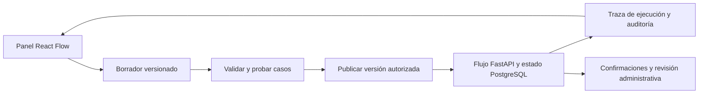

# Panel visual y alternativas de voz para Nexqori

Comparación consultada el **1 de octubre de 2026**, para Bryan y el equipo. Complementa el [diseño de evidencia y escalamiento](flujo-evidencia-y-escalamiento.md) y el [mapa de pruebas](mapa-flujo-y-plan-pruebas.md). Las elecciones y pantallas descritas son propuestas: este trabajo no añade un editor, proveedor de audio ni captura de micrófono.

Recomendación: construir el panel del dominio bancario en React con **React Flow**; considerar **Langfuse** para observar y evaluar los modelos. Para una primera llamada web, comparar **GPT-Live con delegación al backend existente** frente a **LiveKit + AssemblyAI + Jev/Luna + síntesis de voz**. La primera opción reduce componentes de voz; la segunda permite sustituirlos y optimizar costos por separado. No se propone Whisper.

## Alternativas gráficas

| Opción | Qué aporta | Encaje propuesto y trabajo pendiente |
| --- | --- | --- |
| **React Flow** | Biblioteca React para nodos, conexiones e interfaces de flujos; núcleo MIT. | Mejor encaje para un panel propio con identidad Nexqori. Hay que construir formularios, persistencia, validación y ejecución; dibujar una conexión no implementa el contrato. [Documentación](https://reactflow.dev/). |
| **Langflow** | Editor para conectar prompts, modelos, datos y herramientas; playground, API y exportación JSON. | Alternativa para experimentar visualmente con rapidez. Necesita adaptadores para Jev y las APIs de Nexqori; su entorno de ejecución sería un servicio adicional. [Editor](https://docs.langflow.org/concepts-overview), [Docker](https://docs.langflow.org/deployment-docker), [licencia MIT](https://github.com/langflow-ai/langflow/blob/main/LICENSE). |
| **n8n** | Flujos visuales con disparadores y pasos de integración. | Candidato para tareas administrativas e integraciones posteriores: avisos, tickets y procesos externos. Su licencia distingue uso interno de otras formas de distribución; no asumir que ofrecer su editor a clientes está cubierto. [Primer flujo](https://docs.n8n.io/build-your-first-workflow), [licencia del proyecto](https://github.com/n8n-io/n8n/blob/master/LICENSE.md). |
| **Langfuse** | Trazas, sesiones, latencia, costos, prompts versionados y evaluaciones contra datasets. | Complemento para responder «qué salió de Jev/Luna y qué cambió con el prompt». La auditoría de operaciones y aprobaciones sigue en Nexqori. [Documentación](https://langfuse.com/docs). |

La recomendación de encaje es una valoración para este repositorio, no un benchmark entre plataformas. Código con licencia abierta sigue requiriendo mantenimiento, infraestructura y proveedores. No es necesario desplegar todas las opciones.

Airflow conserva el papel propuesto para lotes de datos y evaluaciones. Puede representar tareas y esperas humanas, pero no proporciona por sí solo los formularios bancarios ni un editor especializado de contratos. Véase la [comparación anterior y sus fuentes](flujo-evidencia-y-escalamiento.md).

## Cómo sería el panel propio

Una pantalla con cuatro zonas permite revisar el proceso sin perder la conversación:

| Zona | Contenido |
| --- | --- |
| Casos, a la izquierda | Consulta, cargo no reconocido, importe incorrecto, pago pendiente y los demás contratos existentes. Versión activa y borradores. |
| Flujo, en el centro | Clasificar → consultar datos → evaluar evidencia → preguntar, esperar, proponer o derivar. El recorrido de una ejecución resalta sus pasos reales. |
| Propiedades, a la derecha | Al seleccionar un paso: instrucciones, pregunta ES/EN/PT, herramienta permitida, requisitos y salida esperada. |
| Ejecuciones, debajo | Conversación, salida de cada modelo, fuentes, datos faltantes, duración por etapa, resultado esperado/obtenido y referencias de operación. |

El administrador podría editar preguntas e instrucciones, ejemplos de clasificación, mensajes por idioma, límites de preguntas/reintentos y rutas entre pasos compatibles. Las condiciones se escogerían entre reglas tipadas que conoce el backend. Importar JSON exigiría el mismo esquema y validación; no permitiría introducir Python, SQL, URLs o herramientas arbitrarias.

La API conservaría titularidad, roles, elegibilidad, confirmación, reautenticación, idempotencia y aprobación de devoluciones. Ninguna casilla del editor podría desactivar estos controles. Un prompt tampoco puede convertir un dato declarado en evidencia verificada.

Cada publicación tendría autor, fecha, cambios, resultados de pruebas y versión. Las conversaciones en curso conservarían su versión; migrarlas exigiría una decisión explícita. Volver a una versión anterior sólo afecta la configuración, nunca revierte una operación financiera. La bandeja administrativa mostraría responsable, motivo de espera, NQ/RF/CR y evidencia disponible.

Para el primer incremento, conviene mostrar el flujo y permitir editar los campos de cada paso antes de habilitar conexiones libres. Es menos trabajo y permite evaluar primero el motor de evidencia que todavía falta integrar.

## Transcripción: comparar la misma parte del costo

Precios públicos en **USD**, sin impuestos, descuentos negociados ni créditos gratuitos. Cálculos para una conexión de diez minutos y para mil minutos. Estas filas cubren **sólo transcripción en streaming**, no una conversación completa con respuestas habladas.

| Modelo | Tarifa publicada | 10 minutos | 1.000 minutos | Idiomas relevantes |
| --- | ---: | ---: | ---: | --- |
| AssemblyAI Universal-Streaming Multilingual | US$0,15/h = US$0,0025/min | US$0,025 | US$2,50 | ES, EN, PT. [Tarifas](https://www.assemblyai.com/pricing). |
| Deepgram Nova-3 Multilingual | US$0,0058/min | US$0,058 | US$5,80 | ES, EN, PT. Tarifa promocional de streaming mostrada al consultar. [Tarifas](https://deepgram.com/pricing), [idiomas](https://developers.deepgram.com/docs/models-languages-overview/). |
| Deepgram Flux Multilingual | US$0,0078/min | US$0,078 | US$7,80 | ES, EN, PT; incluye detección de turnos orientada a conversación. [Tarifas](https://deepgram.com/pricing), [modelo e idiomas](https://developers.deepgram.com/docs/flux/language-prompting). |

**AssemblyAI tiene el precio de transcripción más bajo entre estas tres opciones consultadas.** Eso no demuestra que produzca el menor costo por caso resuelto. Hay que medir errores en importes, monedas, nombres, negaciones y referencias, además de preguntas repetidas y latencia.

AssemblyAI factura duración de la sesión de streaming, incluidos sus intervalos de silencio; cerrar la conexión forma parte del control de gasto. [Reglas de facturación](https://support.assemblyai.com/articles/3853403741-how-does-pricing-work).

## Opciones para la llamada completa

| Opción | Precio y alcance comprobados | Aplicación a Nexqori |
| --- | --- | --- |
| **GPT-Live directo** | US$0,05/min de sesión de voz: diez minutos son US$0,50. Backend y herramientas se cobran aparte. [Tarifas](https://developers.openai.com/api/docs/pricing). | Candidato inicial si prima reducir la integración de audio. Con delegación gestionada por nuestra aplicación, puede usar el backend Jev + `gpt-6-luna` con esfuerzo `high`; no es necesario reemplazar Luna. [Arquitectura](https://developers.openai.com/api/docs/guides/live). |
| **Vapi** | US$0,05/min por alojamiento/orquestación en la opción sin paquete de soporte; diez minutos son US$0,50 **antes** de sumar modelos de voz/texto y cargos adicionales. [Tarifas](https://vapi.ai/pricing). | Candidato si prima disponer de un panel listo para configurar y probar asistentes. Admite llamadas desde navegador y backend personalizado; conectar el flujo propio requiere un adaptador. [Panel](https://docs.vapi.ai/assistants/quickstart), [backend propio](https://docs.vapi.ai/customization/custom-llm/fine-tuned-openai-models). |
| **LiveKit Agents** | Framework Apache 2.0 y opción de alojamiento propio. Cloud Build incluye 1.000 minutos de agente; Ship parte de US$50/mes e incluye 5.000, luego US$0,01/min de agente. Inferencia, transporte y otras partidas se presupuestan según uso/plan. [Framework](https://docs.livekit.io/agents/), [tarifas](https://livekit.com/pricing). | Mayor control de la cadena STT → Jev/Luna → TTS, turnos e interrupciones. Requiere programar y operar el agente. Los minutos incluidos de infraestructura no son minutos de todos los modelos gratis. |

GPT-Live mantiene la conversación mientras el backend trabaja y permite elegir ese backend por separado. La integración propuesta conservaría clasificación, evidencia y operaciones en FastAPI. Es una inferencia de encaje basada en la API; todavía no se probó con Nexqori. [Delegación](https://developers.openai.com/api/docs/guides/live).

El modelo de voz tiene sus propios requisitos de acceso; el nivel gratuito no está admitido. No se consultó la cuenta ni se usó la clave del proyecto para comprobar disponibilidad. Hay voces documentadas para distintos idiomas, pero la elección debe comprobarse con ES/EN/PT, acentos y pronunciación bancaria. [Acceso del modelo](https://developers.openai.com/api/docs/models/gpt-live-1), [sesiones y voces](https://developers.openai.com/api/docs/guides/live-conversations).

Otra alternativa es Realtime, donde un modelo de audio concentra conversación y herramientas y se factura por tokens. No equivale a activar audio en Luna; por eso aquí se prioriza la delegación o la cadena modular, que preservan el flujo acordado. [Comparación de arquitecturas](https://developers.openai.com/api/docs/guides/voice-agents).

### Presupuesto y duración

Para una llamada web modular:

`costo = STT + Jev + tokens de Luna + TTS + transporte/alojamiento + observabilidad seleccionada`

Para GPT-Live directo:

`costo = segundos facturables / 60 × 0,05 USD + Jev + tokens de Luna + herramientas/alojamiento propios`

Cien llamadas de diez minutos supondrían **US$50 de la capa de voz GPT-Live**, más el backend. La misma duración con AssemblyAI supondría **US$2,50 sólo de transcripción**; falta presupuestar las demás piezas. No son totales comparables. Jev y Luna deben medirse con el uso real acumulado de todos los turnos, incluyendo historial, reintentos y razonamiento facturable. [Costo de sesiones](https://developers.openai.com/api/docs/guides/voice-latency-cost).

La propuesta inicial es llamar desde el navegador de Nexqori. Una llamada por número telefónico añade operador/SIP, número y tarifas por país. No están incluidas en esos ejemplos.

El futuro panel podría configurar sesiones de **5 o 10 minutos**, idioma, proveedor y presupuesto. El backend impondría el tiempo máximo y cerraría la sesión remota; también limitaría inactividad, llamadas a herramientas, reintentos y tokens. Un contador visible no basta para detener la facturación. GPT-Live incluye silencio y espera del backend en la duración facturada. [Contabilidad de voz](https://developers.openai.com/api/docs/guides/voice-latency-cost).

La interfaz ofrecería iniciar, silenciar, finalizar, transcripción y continuar por texto. La voz utilizaría las mismas confirmaciones y permisos de la app. La grabación persistente de audio sería una opción separada de la transcripción y auditoría; no se activa por añadir la llamada.

## Orden de avance y prueba comparativa

1. **Evaluador y traza:** completar la decisión por evidencia y mostrar el recorrido de los tres casos existentes, con fuentes y estados. Es la base que compartirían texto y voz.
2. **Editor acotado:** preguntas, instrucciones ES/EN/PT y reglas permitidas; borrador, prueba, publicación, historial y reversión de configuración.
3. **Bandeja administrativa:** responsable, evidencia pendiente, revisión, resolución y seguimiento correlacionados con conversación y operación.
4. **Piloto de voz separado:** probar GPT-Live frente a la cadena LiveKit + AssemblyAI + TTS seleccionado, con el mismo backend y límites. Vapi queda como alternativa si se prioriza un panel externo ya hecho.

Usar los [tres escenarios repetibles](pruebas-tres-casos.md), tres idiomas y al menos tres repeticiones por variante: **27 conversaciones por variante** como piloto, sin presentar esa muestra como un benchmark concluyente. Mantener constantes reglas, estado inicial y modelos del backend. Las conversaciones de evaluación son casos reconstruidos, no grabaciones auténticas del dataset.

| Medida | Qué validar |
| --- | --- |
| Comprensión | Importe, moneda, referencia y negación correctos; clasificación consulta/problema y contrato. |
| Conversación | Tiempo desde fin del turno hasta respuesta audible útil, p50/p95, interrupciones, silencios y reconexiones. |
| Resolución | Resultado persistido correcto, preguntas necesarias, derivación con contexto y aprobación cuando corresponda. |
| Costo | Costo completo por llamada y por caso resuelto; incluir fallos, reintentos y esperas facturables. |
| Controles | Recursos del titular, ninguna operación sin confirmación y ningún segundo abono por repetición. |

No se ejecutaron pruebas de voz ni se midieron latencias o calidad de estos proveedores en este encargo. Esta comparación permite elegir el piloto; no afirma un ganador de calidad ni que la integración esté terminada.
