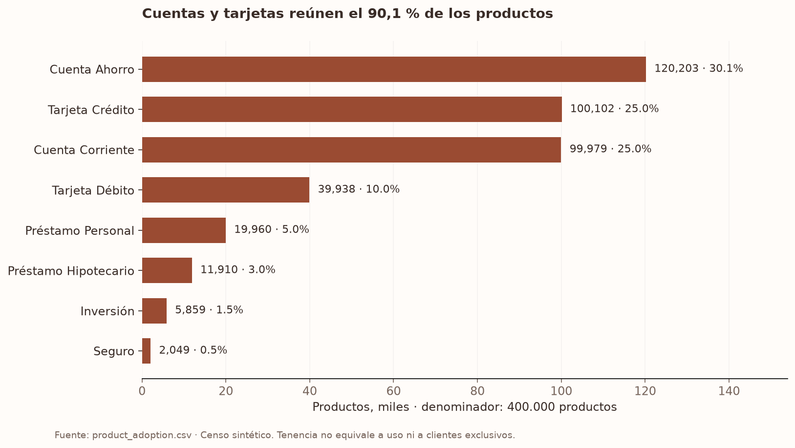
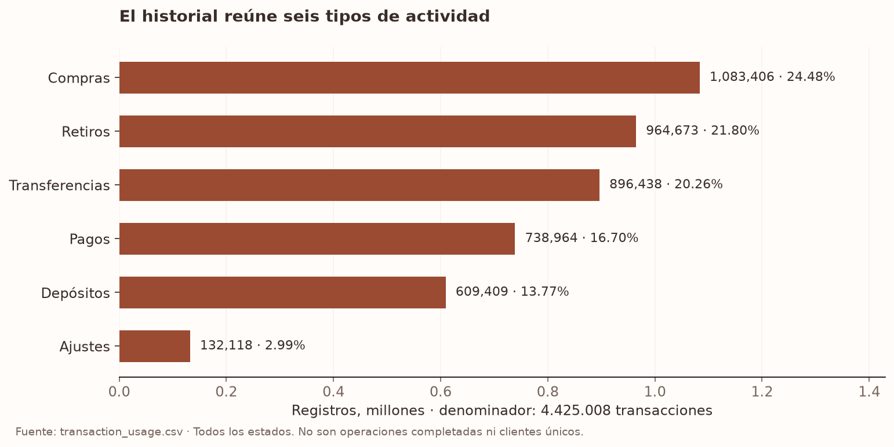
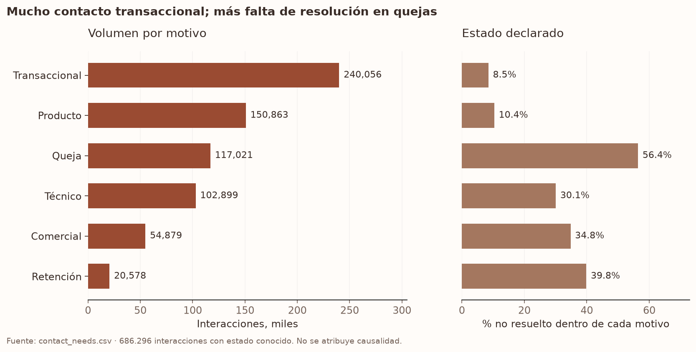

# Servicios para la base Nexqori

**Decisión:** priorizar cuentas, tarjetas, movimientos, transferencias, pagos y seguimiento de solicitudes. Préstamos, inversiones y seguros quedan disponibles como consulta. Esta prioridad combina tenencia, actividad y necesidades de atención; es una interpretación de un dataset sintético, no una estimación de demanda real ni de impacto.

Análisis del 28 de septiembre de 2026. [Cuaderno ejecutado](../notebooks/SERVICIOS_NEXQORI.ipynb), [18 consultas reproducibles](../scripts/analizar_servicios_nexqori.py), [CSV agregados y manifiesto](../notebooks/servicios_nexqori/analysis.json). Sin registros individuales ni datos personales en los entregables.

## Cobertura y método

Se consultó en modo de sólo lectura la caché DuckDB del censo previo: 7.671 CSV, 13 tablas y 23.495.188 filas. Las consultas de servicios cubren 150.000 clientes, 400.000 productos, 4.425.008 transacciones, 15.620.994 eventos digitales, 686.296 interacciones de atención, 67.095 reclamos y 200 campañas. No se tomaron muestras para estos agregados.

Productos representa una fotografía de tenencia; transacciones y eventos representan actividad histórica. Se cuentan registros y clientes distintos por categoría; los clientes pueden aparecer en varias y no deben sumarse. No se mezclan monedas ni se suman importes monetarios para priorizar.

La actividad transaccional va de 2023-06-17 06:01:30 a 2026-06-18 05:59:41; la digital termina a las 06:04:05 del último día. El origen no declara zona horaria en esos timestamps. Se usan marzo–mayo de 2026 para contrastar tres meses completos, evitando los extremos parciales. El análisis es histórico; junio de 2026 no significa actividad actual de septiembre.

## 1. Tenencia: cuentas y tarjetas como entrada

| Tipo | Productos | % de 400.000 productos | Clientes distintos | % de 150.000 clientes |
| --- | ---: | ---: | ---: | ---: |
| Cuenta de ahorro | 120.203 | 30,05 % | 82.695 | 55,13 % |
| Tarjeta de crédito | 100.102 | 25,03 % | 73.177 | 48,78 % |
| Cuenta corriente | 99.979 | 24,99 % | 72.843 | 48,56 % |
| Tarjeta de débito | 39.938 | 9,98 % | 35.015 | 23,34 % |
| Préstamo personal | 19.960 | 4,99 % | 18.615 | 12,41 % |
| Préstamo hipotecario | 11.910 | 2,98 % | 11.417 | 7,61 % |
| Inversión | 5.859 | 1,46 % | 5.750 | 3,83 % |
| Seguro | 2.049 | 0,51 % | 2.036 | 1,36 % |

Fuente: [product_adoption.csv](../notebooks/servicios_nexqori/product_adoption.csv). Las cuatro primeras categorías suman 360.222 productos (90,06 %). 139.578 clientes poseen al menos un producto. Tenencia, estado activo y vinculación a una app son medidas diferentes; ninguna prueba uso reciente por sí sola.

**En la app:** productos propios, saldos por moneda, filtro cuentas/tarjetas y acceso a movimientos del producto. El seed pequeño ilustra cuentas y débito; crédito y préstamos todavía no tienen modelo operativo de deuda, límite, cuotas o vencimientos.

## 2. Actividad: transferencias y pagos necesitan rutas propias

| Actividad | Registros | % del historial | Clientes distintos |
| --- | ---: | ---: | ---: |
| Compra | 1.083.406 | 24,48 % | 82.134 |
| Retiro | 964.673 | 21,80 % | 127.531 |
| Transferencia | 896.438 | 20,26 % | 112.914 |
| Pago | 738.964 | 16,70 % | 125.736 |
| Depósito | 609.409 | 13,77 % | 104.719 |
| Ajuste | 132.118 | 2,99 % | 29.746 |

Fuente: [transaction_usage.csv](../notebooks/servicios_nexqori/transaction_usage.csv). Incluye 4.070.681 Approved, 221.234 Declined, 88.343 Pending y 44.750 Reversed. Son todos los estados, no sólo operaciones completadas. El dominio del origen no contiene Completed.

El mix de marzo–mayo difiere como máximo 0,114 puntos porcentuales del histórico. La máxima diferencia de participación por tipo entre México, Colombia y Argentina es 0,084 puntos. Esa uniformidad limita la extrapolación: no justifica preferencias regionales ni un ranking personalizado. Véanse [ventana reciente](../notebooks/servicios_nexqori/transaction_recent.csv) y [país](../notebooks/servicios_nexqori/transaction_country.csv).

POS y ATM reúnen aproximadamente 65 % de transacciones; App y Web alrededor de 30 %. La actividad total no puede llamarse uso de la app. La unión válida por producto/titular muestra compras en tarjetas, transferencias en cuentas y pagos en varios productos. Un pago no es automáticamente un pago de servicios: para distinguir facturas, tarjetas y cuotas hace falta un contrato de negocio adicional.

**En la app:** historial con estado y referencia, detalle propio, páginas de consulta para transferencias/pagos/efectivo y registro de solicitudes. No hay motor de transferencias, pagos reales ni retiros.

## 3. Comportamiento digital: rutas claras, sin inferir conversión

Hay 902.225 eventos etiquetados initiate_payment, 901.824 initiate_transfer, 901.039 view_transactions, 892.802 view_accounts, 891.777 view_products y 890.625 view_help. view_product suma 3.407.643. Estas etiquetas apoyan rutas visibles y ayuda contextual; **no prueban operaciones completadas**. [Fuente por acción](../notebooks/servicios_nexqori/digital_action.csv).

De 15.620.994 eventos, 3.745.446 son anónimos (23,98 %) y 1.561.432 no tienen acción (10,00 %). Además, 2.190.252 de los 4.381.569 registros etiquetados login/logout contradicen su event_type (49,99 %). En initiate_payment e initiate_transfer aparecen PageView, FormSubmit, Purchase y Error: no existe una correspondencia validada entre etiqueta, sesión y transacción ejecutada. [Cruce acción/tipo](../notebooks/servicios_nexqori/digital_action_type.csv).

**En la app:** login, rutas explícitas y agente que interpreta pedidos ES/EN/PT y usa una lista de destinos permitidos. Se registra el comando emitido; medir apertura exitosa requeriría un evento posterior del frontend. No se usan estas etiquetas inconsistentes para medir conversión ni entrenar el agente.

## 4. Atención: continuidad antes que promesas de resolución

Transaccional (240.056) y Producto (150.863) suman 390.919 contactos, el 56,96 % de 686.296. Queja tiene 117.021 contactos y 56,40 % no resueltos; Técnico, 102.899 y 30,07 %. Queja + Técnico concentran 96.940 de los 160.266 no resueltos (60,49 %), sin demostrar una causa común o qué parte resolvería la app. [Fuente](../notebooks/servicios_nexqori/contact_needs.csv).

Las subcategorías conocidas son cercanas en volumen: cargo no reconocido 12.297, cobro indebido 12.194, problema con app 12.128, atención en sucursal 11.892 y calidad de servicio 11.886; 6.698 carecen de subcategoría. No hay evidencia para presentar un único motivo como dominante. [Reclamos](../notebooks/servicios_nexqori/complaint_needs.csv).

Phone representa 583.250 de 686.296 contactos (84,99 %). Esto justifica conservar contexto al derivar como decisión de diseño; no demuestra que la voz sea superior ni que haya un proveedor telefónico disponible. [Canales](../notebooks/servicios_nexqori/contact_channels.csv).

**En la app:** confirmación, referencia, estado, idempotencia, trazabilidad y derivación simulada. El panel admin puede iniciar revisión. No se contacta automáticamente con un operador real ni se promete devolución o cierre.

## 5. Calidad que cambia la implementación

| Hallazgo | Evidencia | Decisión |
| --- | --- | --- |
| Reclamo–producto apunta a otro titular | 44.570 discrepancias / 44.570 enlaces con producto | No importar esa relación a sesiones de usuario. |
| Evento–producto casi siempre apunta a otro titular | 1.094.226 / 1.094.242 enlaces comparables | No personalizar contexto con esa unión. |
| Transacción–producto–cliente sí concuerda | 0 discrepancias en 4.425.008 transacciones | Usar titularidad explícita y reforzarla con FK compuesta. |
| Acción digital ausente o contradictoria | 10 % ausente; ~50 % login/logout inconsistente | No construir conversión ni entrenar intención con esas etiquetas. |
| Campañas no prueban uso ni elegibilidad | 200 campañas, 22 sin producto promovido | Catálogo informativo; sin ofertas o contratación inferidas. |

Fuente: [quality.csv](../notebooks/servicios_nexqori/quality.csv), [campañas](../notebooks/servicios_nexqori/campaign_products.csv). La base usa fixtures nuevos y ficticios con titularidad coherente; no expone filas del dataset.

## Servicios y alcance incorporado

Ampliación del 28/09/2026: el [catálogo buscable de 20 servicios](catalogo-servicios.md) baja estas categorías a necesidades y empresas concretas. Las [seis consultas adicionales](../notebooks/servicios_nexqori/catalog_evidence.json) verifican Empresa Telefónica, Internet Plus, Cable TV y Servicios Públicos en registros Purchase. Estos nombres no acreditan convenios de recaudación; los formularios registran solicitudes con revisión y seguimiento, sin ejecución monetaria.

| Módulo | Incorporado | Servicio externo o modelo operativo pendiente |
| --- | --- | --- |
| Acceso e idiomas | Sesión, roles y perfil ES/EN/PT | Identidad bancaria, MFA y recuperación de cuenta. |
| Cuentas, tarjetas y movimientos | Consulta propia, filtros y detalle | Saldos reales, crédito y conciliación. |
| Transferencias, pagos y efectivo | Pantalla, navegación y solicitud | Ejecución, límites, beneficiarios, validación y reversión. |
| Préstamos, inversiones y seguros | Entrada de consulta y solicitud por servicio | Contratos, reglas, precios y elegibilidad autorizados. |
| Atención | Casos, revisión y derivación de demo | Operador real y políticas de resolución. |
| Agente | Navegación permitida por reglas ES/EN/PT | Adaptador LLM y evaluación específica. |

## Reproducción y validación

Con los agregados incluidos, instalar `requirements-eda.txt` y ejecutar el cuaderno; no requiere GPU ni acceso al dataset. Todas las salidas se cotejan contra las huellas del manifiesto. Para recalcular el censo de servicios, disponer del dataset autorizado y la caché DuckDB preparada por el EDA integral, y ejecutar `python scripts/analizar_servicios_nexqori.py`.

Pasaron 13 comprobaciones: reconciliación de totales, uniones, meses, dominios, conteo independiente de productos desde CSV y contraste con el censo anterior. El cuaderno se ejecutó completo y los tres gráficos se inspeccionaron. Pasar esos controles acredita los agregados; **no corrige las inconsistencias semánticas del origen ni demuestra eficacia de Nexqori**.
